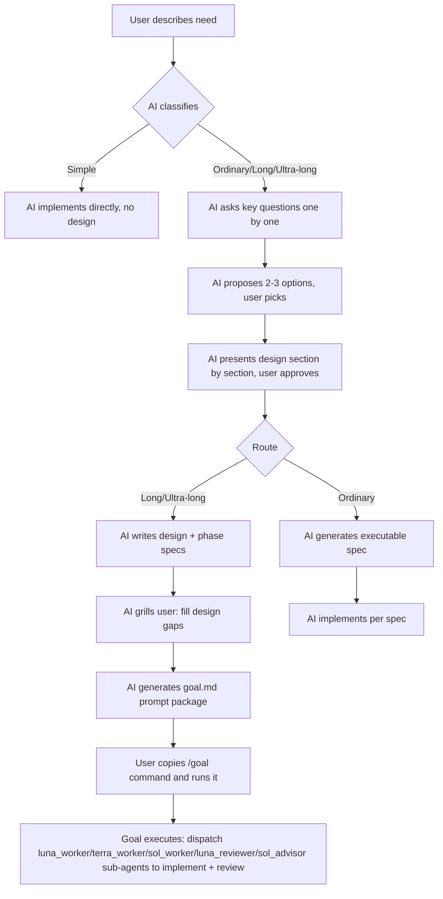
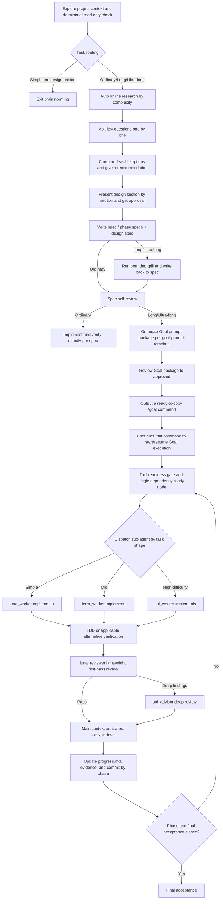

# Brainstorming Goal

> 📖 中文版：[README_ch.md](README_ch.md) ｜ English version: this page

An executable design and long-term Goal workflow for AI coding agents. It builds on Superpowers' `brainstorming`, and for complex development tasks spanning hours, days, or even weeks it adds resumable execution, staged specs, adversarial review, tool preparation, evidence governance, and context-compression recovery.


The core split is simple: **the brainstorming phase is responsible for reading inputs, doing online research, clarifying decisions, and producing an executable spec; the Goal phase only executes the spec that has passed review.** Ordinary tasks stop at a single executable spec; Long and Ultra-long tasks additionally produce `design.md` (the task spec root) and `goal.md` (one ready-to-copy prompt), and the latter dispatches the five sub-agents `luna_worker`/`terra_worker`/`sol_worker`/`luna_reviewer`/`sol_advisor` by task shape at execution time (`luna_reviewer` is a lightweight first-pass review). Users do not need to manually stitch together plans, runbooks, or prompts; at the end of a long-route run they only copy the full Goal produced by the AI.

## Installation

The skill itself lives in the inner repo directory `brainstorming-goal/brainstorming-goal/`, and the skill name is fixed as `brainstorming-goal` (same as the `SKILL.md` frontmatter name; do not rename it to `brainstorming`, it can coexist with the original `superpowers:brainstorming`). Two install steps: (1) install the skill itself into the skills directory; (2) install the 5 sub-agents into the agents directory.

### 1. The skill itself

**Codex user-level (PowerShell)**:
```powershell
git clone https://github.com/foursmile/brainstorming-goal.git
Copy-Item -Recurse -Force .\brainstorming-goal\brainstorming-goal "$env:USERPROFILE\.codex\skills\brainstorming-goal"
```

**Project-level (PowerShell)**:
```powershell
New-Item -ItemType Directory -Force .agents\skills | Out-Null
Copy-Item -Recurse -Force .\brainstorming-goal\brainstorming-goal .agents\skills\brainstorming-goal
```

**macOS / Linux**:
```bash
git clone https://github.com/foursmile/brainstorming-goal.git
cp -R ./brainstorming-goal/brainstorming-goal ~/.codex/skills/brainstorming-goal
```

### 2. Sub-agents

The 5 sub-agent configs live under `agents/` and must be copied into Codex's `agents/` directory to be recognized:

| agent | model | role | sandbox |
|---|---|---|---|
| `luna_worker` | gpt-5.6-luna, max | Simple exploration/search/docs/simple implementation | workspace-write |
| `terra_worker` | gpt-5.6-terra, high | Mid-complexity single-module implementation/testing/routine analysis | workspace-write |
| `sol_worker` | gpt-5.6-sol, max | High-difficulty implementation/cross-module changes/risky migrations | workspace-write |
| `luna_reviewer` | gpt-5.6-luna, max | Lightweight first-pass review of simple nodes | read-only |
| `sol_advisor` | gpt-5.6-sol, high | Complex architecture/security/compat review and high-impact decisions | read-only |

**Windows**: double-click `agents/install-subagents.bat` (auto-copies the 5 toml files to `%USERPROFILE%\.codex\agents\` and prints the result), or from the command line:
```powershell
Copy-Item -Force .\brainstorming-goal\brainstorming-goal\agents\*.toml "$env:USERPROFILE\.codex\agents\"
```

**macOS / Linux**:
```bash
mkdir -p ~/.codex/agents
cp ./brainstorming-goal/brainstorming-goal/agents/*.toml ~/.codex/agents/
```

After installing, restart Codex or start a new task so the skills/agents are discovered. The agent names are consistent with the sub-agent model routing in `SKILL.md` and the dispatch contract in `goal-prompt-template.md`.

### Known issue: `luna_worker` spawn reports Unknown model

In a new session, dispatching `luna_worker` (`gpt-5.6-luna`) may report `Unknown model 'gpt-5.6-luna' for spawn_agent` (available models only include sol/terra) — luna is not activated in that session. **Workaround** (at the start of each new session):

1. Switch the model to **luna** (`/model gpt-5.6-luna`);
2. Send a `hi` to run one round of conversation to activate luna;
3. Switch back to **sol-high** as the main model;
4. Enter the brainstorming-goal flow. After activation, `luna_worker`/`luna_reviewer` no longer error; `terra_worker`/`sol_worker`/`sol_advisor` use terra/sol, which are already available.


## User-facing flow

The diagram below highlights only **the steps that interact with the user** and **the Goal deliverable** (the full internal flow is in [Complete workflow](#complete-workflow)):



Nodes prefixed `User`/`U` are steps the user participates in; `goal.md` is the Long/Ultra-long deliverable (the user just copies and runs it). Ordinary tasks stop at the spec, and the AI implements directly.

## What problem it solves

Ordinary brainstorming is good at clarifying requirements and design before coding, but ultra-long tasks run into another set of problems:

- Even simple changes are forced through the full design flow, adding overhead;
- External research happens too late to actually shape the architecture and spec;
- Design documents and implementation plans duplicate each other, and the two drift apart;
- Large tasks lack phase boundaries, architecture gates, progress records, and resumption entry points;
- After context compression, the agent may repeat questions, lose the next step, or redo expensive operations;
- Sub-agent reports are taken as fact without independent verification;
- When tooling is insufficient, results are guessed, or retries repeat on the same failed assumption;
- Goals like "done, correct, consistent, lossless" are not converted into verifiable evidence;
- Long-running execution produces too much status reporting, consuming context and output tokens.

This skill extends brainstorming from a one-off design conversation into an executable design pipeline that branches by task size, while preserving one principle: **when there is a design decision, design first; for simple tasks, exit immediately.**

## What it improves over the original brainstorming

| Dimension | Original common flow | This project's flow |
| --- | --- | --- |
| Simple tasks | All enter the design flow | Clearly low-risk mechanical tasks exit immediately; this skill is not invoked unless the user explicitly asks |
| External research | Ad-hoc search during implementation | Auto-connects by complexity after classification (without asking the user); research evidence is written back to the spec before the design is frozen |
| Document structure | Separate plan generated after design | The spec itself contains ordered implementation steps; creating a separate plan document is forbidden |
| Long-task splitting | A single design document | Generates phase specs by requirement, dependency, and review boundaries, then a design spec |
| Long-task directory | Artifacts scattered across multiple root directories | design.md goes inside the `task_key/` task directory (same directory as goal.md); ordinary `*-design.md` still sits flat in the `specs/` root; the runtime record is a single `progress.md` next to `goal.md` |
| Large-module design | Directly splits into coding tasks | First passes the architecture-first gate, then freezes module contracts before entering node development |
| Requirement follow-up | Ordinary Q&A | bounded grill runs only after phase specs and the design draft are complete; only after grill does spec self-review and Goal review proceed |
| Sub-agents | General-purpose execution | Five-tier fully-named routing: simple→`luna_worker`, mid→`terra_worker`, high-difficulty implementation→`sol_worker`, lightweight first-pass review→`luna_reviewer` (read-only), complex review/decisions→`sol_advisor` (read-only); each tier has role-specific stop conditions and escalation paths; the main context owns integration and final acceptance |
| Review | Only reviewed at the end | Layered review of core nodes, phases, and final acceptance; fix, re-test, and re-review before continuing |
| Context recovery | Relies on conversation history | Uses `progress.md` as a single file to recover the exact next step, with no extra runtime directory |
| Insufficient tooling | Ad-hoc handling | Passes a tool-readiness gate first; retrieves or implements a minimal MCP/equivalent capability when needed |
| Evidence | "Tests pass" is enough | Records inputs, versions, environment, commands, paths, hashes, and invalidation conditions to avoid reusing stale evidence |
| Long-term focus | Relies on constant reminders | PUA self-triggers by scenario (2+ failures, etc.); this skill adds a 20-minute periodic focus calibration (safe boundaries only; pauses during active commands/tests/reviews, re-checks once on resume; silent when nothing changes) |
| Goal generation | Manually stitch templates | AI generates one task-specific Goal from the reviewed spec, in the user's input language (Chinese input→Simplified Chinese; otherwise English) |
| User review | Waits for user review | No user-review gate; after writing the spec/Goal package, it goes straight into self-review and implementation |

## Task routing

The skill does the smallest read-only check first, then picks a route by observable scope:

| Route | Decision criteria | Deliverable |
| --- | --- | --- |
| Simple exit | Goal is clear, local, low-risk, no substantive design choices | Exit this skill, enter normal implementation and verification |
| Ordinary design | Meaningful design choices exist, usually completes within about two hours | One executable spec |
| Long Goal | Over two hours, crosses requirement boundaries, needs interruption-resumption or multiple bounded agents | phase specs, design spec, a lean Goal package |
| Ultra-long Goal | Lasts days or weeks, expensive baselines, long-running processes, large inventories, or complex evidence chains | Long Goal deliverables plus stronger phase-level evidence and review governance (work-item inventory / tool probes / deterministic comparison / long-process monitoring / second-pass check at phase exit) |

Time is only a signal. Public interfaces, security, data migration, compatibility, and irreversible operations cannot be treated as simple tasks even when little code is involved.

## Sub-agent routing

During Long/Ultra-long Goal execution, the main context dispatches sub-agents by task shape; each tier has a distinct role and a clear escalation path:

| Task shape | agent | model | role |
|---|---|---|---|
| Simple exploration/search/docs/simple implementation | `luna_worker` | gpt-5.6-luna, max | Quickly closes simple packages with minimal diff; hands back when beyond simple |
| Mid-complexity single-module implementation/testing/routine analysis | `terra_worker` | gpt-5.6-terra, high | Focuses on a single module; escalates to sol for cross-module/high-difficulty |
| High-difficulty implementation/cross-module changes/risky migrations | `sol_worker` | gpt-5.6-sol, max | Changes carefully, keeps compatibility; stops and reports with evidence when out of package/irreversible |
| Lightweight first-pass review of simple nodes | `luna_reviewer` | gpt-5.6-luna, max | **Read-only**, checks common-sense bugs/boundaries/static leaks/duplicate interfaces/tests/oversize/perf UIUX/tidiness; escalates deep findings to sol_advisor |
| Complex architecture/security/compat review and high-impact decisions | `sol_advisor` | gpt-5.6-sol, high | **Read-only**, gives decision advice and evidence, does not implement |

The three workers (luna/terra/sol) share stop conditions: ambiguous requirements, unexpected interface/dependency changes, security or data-integrity impact, verification unavailable, scope expansion, two failures — stop and return evidence, do not push through. `luna_reviewer` and `sol_advisor` are read-only; they return findings/recommendations + evidence and never claim implementation; deep findings from `luna_reviewer` escalate to `sol_advisor`. The main context owns integration and final acceptance, checking the actual diff and verification results, and does not accept summaries alone. Unavailable models/channels record `agent_unavailable`, fall back or stay in the main context, and never fabricate.

The five-tier agent names are consistent with the sub-agent model routing in `SKILL.md` and the dispatch contract in `goal-prompt-template.md`; installation is in [Sub-agent installation](#2-sub-agents) below.

## Complete workflow



### 1. Context and routing

Read the user's instructions, repo rules, relevant source, docs, and recent changes — only enough to decide the route, avoiding loading all the long-workflow reference files prematurely for ordinary tasks.

Then do the minimal read-only check and route to Simple exit / Ordinary / Long / Ultra-long by observable scope. Simple, clear, low-risk mechanical tasks do not invoke this skill unless the user explicitly asks.

### 2. Online research gate (brainstorming phase)

After the minimal read-only check and task routing, immediately decide whether to go online by task complexity:

- Exploratory, open-ended, niche, emerging, time-sensitive, uncertain, or tasks that explicitly need external reference: retrieve authoritative sources during the clarification and design kickoff;
- Mid-to-large tasks: retrieve maintained similar frameworks, libraries, tools, test facilities, or reference repos on GitHub before the architecture, phase specs, and design spec are frozen;
- Simple, stable, local tasks do not go online for form's sake; record `research_not_required` and continue.

Every retrieval must enter the external evidence ledger, recording at least the question, URL/repo, version or commit, access time, conclusion and limitations, license/security/maintenance/version fit, adoption or rejection reason, verification action, and invalidation conditions. **Research evidence is written back to the spec**, design, and traceability, and design decisions changed by external evidence are re-reviewed. Model's prior knowledge can only serve as a hypothesis to verify, not as a claim of having read or summarized model training weights.

Goal only executes the reviewed spec and does not take on another round of online research; only when the spec explicitly declares a runtime research task does Goal execute that step.

### 3. Forming an executable design

When design space remains, ask only one key question at a time, preferably offering selectable answers and their consequences. Then compare two or three genuinely feasible options, explain the recommendation and YAGNI trade-offs.

Ordinary tasks produce one executable spec, which directly contains:

- Goals, scope, non-goals, and constraints;
- Architecture, modules, interfaces, state flow, errors, and compatibility strategy;
- Ordered implementation steps with target files or discovery rules;
- TDD or an applicable alternative verification method;
- Commands, expected results, evidence locations, rollback conditions, and completion criteria.

After the spec passes self-check, development begins directly; no writing-plans document is generated.

### 4. Designing long tasks by phase

Long Goal and Ultra-long Goal split phase specs by requirement, dependency, and review boundaries — not by evenly slicing file counts. The design spec summarizes end-to-end architecture, phase order, interface contracts, acceptance mapping, and recovery rules, and becomes the source of truth for the implementation phase.

Each long task uses a stable `task_key = YYYY-MM-DD-<topic>`:

```text
docs/superpowers/specs/
└── YYYY-MM-DD-<topic>/
    ├── design.md
    ├── goal.md
    ├── phases/
    └── progress.md (optional runtime record)
```

The design and task directory must use the same `task_key` and record each other's path and version. For same-named tasks, prefer adding a human-readable scope word; only when there is no semantic difference, use a simple sequence like `-02`; the creation date and directory name stay stable across later edits. `<topic>` uses a stable, readable, path-separator-free short topic name (Chinese, letters, digits, and hyphens allowed); it must not use reserved directory names or distinguish only by random characters. File and directory names must not include CRC, SHA, UUID, or random short codes. Hashes are kept as document metadata only when detecting content drift or verifying evidence integrity. `design.md` sits at the same level as the task directory, inside `task_key/`, for discoverability; ordinary `*-design.md` still sits flat in the `specs/` root; phase specs, Goal, and runtime records do not pollute the root. The runtime record is a single optional `progress.md` next to `goal.md`; no extra runtime directories or ledger subtrees are created.

Before coding each large module, the architecture-first gate must pass:

- First clarify module boundaries, dependency direction, state flow, extension points, resource limits, fault isolation, observability, and rollback;
- Use the GitHub/authoritative evidence already formed by the kickoff research gate; when new load-bearing unknowns appear, return to the research gate and update the spec;
- Do not form a single oversized file or oversized function; maintain high cohesion and low coupling by responsibility and rate of change;
- Advance via phase gates: architecture baseline → contract freeze → core nodes → node review → module integration and stress verification → phase delivery.

### 5. Design Spec gap grill

**Design intent**: the "propose 2-3 options" step in the early brainstorming phase is a **fuzzy process** — requirements are undecided, so options are proposed against fuzzy requirements for the user to pick and clarify direction. grill is the refinement **after** the fuzzy process has been shaped by the model's design — once the design draft (phase specs + design draft) is out, the user answers one by one about the **semantic gaps exposed during design**. Both ask the user, but the timing and object differ: proposing options is before design, object is "which path"; grill is after design, object is "what in the design is not pinned down". Ordinary design does not run grill; only Long/Ultra-long runs grill after the design document is written.

After the phase specs and design draft are complete, run the design gap interview (inlined in SKILL's Long/Ultra Goal extension; the grillme-with-docs file is no longer distributed locally, but the reference and protocol declaration to the mattpocock/skills upstream repo is retained). It is not a prerequisite of ordinary brainstorming, nor does it ask the user to read the entire document.

It only asks about gaps that would change: behavior, scope, permissions, irreversible decisions, dependencies, acceptance criteria, or blockers. Each answer immediately updates the design, affected phase specs, decision records, and traceability.

- Ask only one question at a time;
- Default cap of 12 questions;
- Answered questions are not re-asked;
- When there are no substantive gaps, take the zero-question path;
- Unanswerable load-bearing questions stay `blocked`; do not silently fill defaults.

### 6. Goal package and execution loop

The long route produces:

- `<task_key>/design.md`: the task spec root, summarizing end-to-end architecture, phase order, interface contracts, acceptance mapping, and recovery rules;
- `<task_key>/goal.md`: the full prompt the user uses to create or resume the long Goal;
- `<task_key>/progress.md`: the only runtime record, a lean real-time status and the next evidence-producing command; created only when persistence across interruptions is needed, with no extra directories.

When long execution hits a conflict, it is resolved by a fixed source-of-truth priority: current user instructions and repo rules → reviewed design spec → applicable phase spec → optional `progress.md`. Lower-level records cannot silently modify higher-level specs; when implementation discovers a spec defect, write back the affected spec, update traceability, review the discrepancy, then resume execution.

Although `references/goal-prompt-template.md` keeps its historical filename, it is not a fixed prompt to copy directly — it is a generation and review contract. Only after the phase specs and design spec are written, the bounded grill is complete, and the spec self-review passes, does the AI generate the task-specific Goal prompt package per that contract; `goal.md` is generated in the user's input language (Chinese input→Simplified Chinese; otherwise English). The main context arbitrates and fixes all valid issues and reviews to `approved` before producing the Goal the user actually runs. The Goal does not copy the full design, nor does it add gates the current task does not have based on a generic template. A candidate Goal does not start or resume a task; execution may begin only when there is explicit authorization covering an unchanged scope, or the user explicitly issues a start/resume command.

The final deliverable is a single ready-to-copy Goal prompt. It must embed the resolved startup file list, portable path-resolution rules, and read order; the user does not need to manually stitch absolute paths or replace placeholders. The pre-generation brainstorming input-read gate and the source set at Goal startup/resume are two independent stages.

The generation phase also maintains a requirement-to-proof coverage relation: every applicable spec item maps to a Goal rule, implementation goal, verification, review, evidence, and end state; missing mappings record `coverage_gap`. Changes to `task_key`, paths, versions, or hashes are identity drift — stop first, compare, fix the bidirectional links between design and the task directory, and re-review. The task spec may add stricter review, evidence, tool, UX, or delivery gates, but cannot lower the skill's safety and authorization boundaries; when acceptance requires a real UI, screenshots, external effects, or current evidence, it must not be downgraded to mock, static pages, headless smoke, synthetic results, or old artifacts.

The actual Goal of Long Goal and Ultra-long Goal must include the original skill-enable clause: at startup, read `references/caveman/SKILL.md` and `references/pua/SKILL.md` from the currently installed skill directory. PUA self-triggers by scenario (2+ failures, etc.); this skill adds a 20-minute periodic focus calibration — only at safe command/tool boundaries, paused during active commands/tests/reviews, re-checks once on resume. It does not maintain derived profiles, absolute machine paths, or version or SHA-256 registries.

The actual Goal does not copy or rewrite Caveman/PUA content, nor does it ask the user to manually replace absolute paths; the skill directory is resolved by install location, and copying to another machine or project still works. Mid-to-long Goals activate Caveman by default; the two skills only affect expression and focus, and cannot override user/repo rules, spec, authorization, evidence, retry limits, blocking, or end states.

Each round implements only one dependency-ready core node. Behavior changes follow RED → GREEN → REFACTOR; diagnostics, docs, baselines, and external operations use the alternative verification mode declared in the phase spec.

After a node completes, run this closed loop:

1. Save the actual diff, tests, and evidence;
2. Have an independent, minimal-context reviewer do adversarial review (including: is the code over-inflated, can it be expressed more concisely, can existing implementations be reused);
3. The main context fixes each issue, rejects with evidence, grants an authorization exception, or arbitrates a blocker;
4. After fixing, run a scoped re-test and any necessary re-review;
5. Update the optional `progress.md` and evidence identity;
6. Do one phase commit per repo rules, not tied to Git, SVN, or any specific tool;
7. Enter the next node or next phase only after passing the exit gate.

When an independent reviewer is unavailable, low/medium-risk nodes may substitute an independent second-pass review of saved inputs and record `review_substitute`; high-risk gates that explicitly require an independent context must record `review_unavailable` and stay blocked — do not fabricate an independent review.

### 7. Tool preparation and evidence governance

Phases that depend on fetching, comparing, diagnosing, profiling, or reporting must first pass a tool-readiness gate:

1. Define the output contract needed for acceptance;
2. Probe existing tools and in-repo capabilities;
3. When capability is insufficient, query maintained MCPs, equivalent tools, authoritative docs, or public source;
4. Adopt or implement only the minimal capability that meets the real acceptance need;
5. Run a capability probe or contract test;
6. Record version, limitations, failure modes, security and license impact.

Multiple failures on the same problem do not automatically authorize unlimited retries or scope expansion. After hitting the retry cap, stop on the same assumption, record facts, exclusions, blockers, release conditions, and the next hypothesis that can produce new evidence.

### 8. Context compression and recovery

After context compression or task interruption, do not rely on conversation memory to re-guess progress — read in order:

1. Repo rules;
2. Current version of design;
3. Optional `progress.md` (runtime record);
4. The recorded next command and its preconditions.

If persisted records conflict, fix the state by source priority first, then continue implementation. Answered questions and already-handled interjected messages are not re-responded to during auto-resume.

### 9. Ultra-long extensions

Tasks lasting days or weeks additionally manage:

- A reproducible baseline;
- A full work-item inventory (with stable IDs, scope, dependencies, verification, evidence, risk, and terminal state);
- Explicit authorization and write scope (allowed, test-only, read-only, generated, external, and forbidden targets);
- requirement → implementation → validation → review → evidence traceability;
- Tool capability records and an evidence index (as supporting records with explicit links);
- Identity, hash, and invalidation conditions of expensive baselines;
- Health probes, observation windows, and recovery commands for long-running processes;
- An independent second-pass check at each phase exit;
- Final integrity verification and unclosed-item scan.

Implementation state and evidence state are always separate. When code is written but evidence is missing or stale, the state can only be `unverified` and cannot be textually upgraded to "done".

## How to use

When the requirement involves unresolved behavior, architecture, compatibility, UX, or other substantive design trade-offs, just describe the goal and constraints. For example:

```text
Please design and implement this feature. It will likely take several days,
may be interrupted midway, and I'd like it to automatically resume from
the last progress when complete.
```

For clear, low-risk, mechanical changes, you do not need to invoke this skill; it will take the Simple exit.

After the long route completes design, the AI outputs a full Goal with real paths, versions, and startup order already resolved. The user just copies the full Goal to create the task — no need to assemble the prompt from the README, spec, or template.

## Real-world use case: migrating a long-running task-scheduling platform

Below is a generic but realistic-engineering-scale example showing the full usage. The goal is to migrate an old task-scheduling platform to a new architecture, language- and framework-agnostic, while keeping old-client compatibility, over about three weeks.

### User input

```text
We want to migrate the existing task-scheduling platform to a new scalable
architecture, over about three weeks. Requirements: old clients keep
working; the new architecture supports horizontal scaling, failure
recovery, task idempotency, and stress testing; we cannot change it all
at once, we must proceed module by module.
```

### How the skill handles it

1. **Classifies as Ultra-long Goal**: the task spans weeks, includes compatibility migration, long-term state, stress evidence, and expensive baselines.
2. **Kickoff online research**: before drawing architecture conclusions, retrieves maintained similar scheduling frameworks and authoritative sources, records version, license, fit limits, and adoption/rejection reasons, and writes conclusions into the research ledger.
3. **Clarifies load-bearing decisions**: combined with repo facts and online evidence, confirms one by one the old-protocol support scope, idempotency definition, failure semantics, capacity targets, migration rollback, and acceptance evidence.
4. **Architecture first and forms phase specs**: freezes module boundaries, state machines, storage interfaces, and failure-recovery contracts, then generates phase specs for baseline, contracts, tool preparation, scheduling core, compatibility adapter, migration, and final acceptance.
5. **Generates the design spec**: maps each requirement to implementation nodes, tests, reviewers, evidence, and state, and folds in research conclusions and invalidation conditions.
6. **Runs bounded grill**: finds "task duplicate-execution tolerance" and "old-client deprecation boundary" still unclear, asks the user item by item and writes back to the relevant specs.
7. **Runs bounded grill and self-reviews**: after grill write-back, does a spec self-review; then generates the Goal prompt in the user's input language per the `goal-prompt-template.md` contract and reviews to `approved`; the user only copies the final full Goal.
8. **Executes by node**: first writes a failing test for the idempotent state transition, then implements the minimal logic; an independent reviewer checks races, compatibility, and resource release; the main context fixes and re-tests.
9. **Records and commits phase results**: writes evidence identity, review conclusions, and the next command into the optional `progress.md`, then commits per phase per repo rules.
10. **Resumes after interruption**: a new context reads persisted docs by source-of-truth priority, confirms the previous node passed review, and continues from the next stress-test command without re-fetching the un-stale baseline.
11. **Final acceptance**: checks one by one old-client compatibility, task idempotency, failure recovery, capacity metrics, resource usage, migration rollback, and all inventory IDs; items lacking current evidence stay `unverified`.

### Example expected output

```text
docs/superpowers/specs/
└── 2026-08-02-task-platform/
    ├── design.md
    ├── goal.md
    ├── phases/
    │   ├── phase-01-baseline.md
    │   ├── phase-02-contracts.md
    │   └── phase-03-core.md
    └── progress.md (optional runtime record)
```

The filenames are illustrative only; actual paths, date formats, and document metadata always follow the target repo's rules. Different Goals must use a unique, human-readable `task_key`; they cannot reuse another task's directory, nor use CRC/hash to manufacture uniqueness. The runtime record is a single optional `progress.md` next to `goal.md`; no `progress/` subdirectory or ledger tree is created. Work-item inventories, decision records, traceability, and evidence indexes are supporting records inside spec sections or with explicit links, not mandatory directories.

## Directory structure

```text
brainstorming-goal/
├── SKILL.md
├── SKILL_ch.md
├── agents/
│   ├── openai.yaml
│   ├── luna_worker.toml
│   ├── terra_worker.toml
│   ├── sol_worker.toml
│   ├── luna_reviewer.toml
│   ├── sol_advisor.toml
│   └── install-subagents.bat
├── references/
│   ├── long-goal-workflow.md
│   ├── ultra-long-goal-workflow.md
│   ├── goal-prompt-template.md (target Goal generation and review contract, not a fixed template)
│   ├── caveman/
│   └── pua/
└── spec-document-reviewer-prompt.md
```

## Pre-release checks

- Confirm the directory name is consistent with the `name` policy in `SKILL.md`;
- Confirm `agents/openai.yaml`'s `display_name` is `Brainstorming Goal`;
- Do not commit `__pycache__/`, `*.pyc`, logs, `.superpowers/` runtime directories, or editor caches;
- Record the specific version or commit of third-party sources and update the third-party notices;
- Confirm the original `caveman` and `pua` skill files are distributed with this skill and read from the current skill directory at Goal startup; do not copy them as derived profiles or hardcode machine paths;
- Keep the executable bit on shell scripts;
- Verify the Simple, Ordinary, Long, and Ultra-long routes separately with fresh contexts;
- Manually review the full diff before release; do not bring local caches, private paths, keys, or real project data into the repo.

## References and derivation

This repo is a community derivative project; it is not part of Superpowers, Matt Pocock Skills, Caveman, or PUA, and does not represent the positions of those upstream maintainers.

| Source | Core capability referenced | Main adjustments in this project |
| --- | --- | --- |
| [obra/superpowers](https://github.com/obra/superpowers) | brainstorming's requirement clarification, option comparison, design approval, and TDD/review/verification philosophy | Adds simple-task exit, long-Goal routing, removes the standalone writing-plans stage, and develops directly from the executable spec |
| [grill-with-docs](https://github.com/mattpocock/skills/blob/main/docs/engineering/grill-with-docs.md) from [mattpocock/skills](https://github.com/mattpocock/skills) | Exposes semantic gaps in design and docs via one-by-one interviews | Simplifies core rules inline into SKILL's Long/Ultra Goal extension (Design gap grill section), runs only after the design spec draft is complete; max 12 questions, each answer written back to spec immediately, allows a zero-question path; the upstream repo reference is retained (see the link in the left column and [THIRD_PARTY_NOTICES.md](THIRD_PARTY_NOTICES.md)), only the grillme-with-docs file is no longer distributed locally |
| [JuliusBrussee/caveman](https://github.com/JuliusBrussee/caveman) | Provides compact expression for mid-to-long Goals by default | At Long/Ultra Goal startup, reads the original files in the skill copy and activates by default; `normal mode`/`stop caveman` can exit; does not maintain derived profiles |
| [tanweai/pua](https://github.com/tanweai/pua) | Re-focuses on the problem on repeated failures, passive waiting, and premature giving up | At Long/Ultra Goal startup, reads the SKILL.md in the skill copy; PUA self-triggers by scenario (2+ failures, etc.), and this skill adds a 20-minute periodic focus calibration (safe boundaries; pauses during active commands/tests/reviews, re-checks once on resume); does not maintain derived profiles |

See [THIRD_PARTY_NOTICES.md](THIRD_PARTY_NOTICES.md) for detailed copyright, license status, and third-party file scope.

## License

This project's own code uses the MIT License in the root [LICENSE](LICENSE). Source files and derived content retain their respective upstream copyright and license requirements; see [THIRD_PARTY_NOTICES.md](THIRD_PARTY_NOTICES.md).
