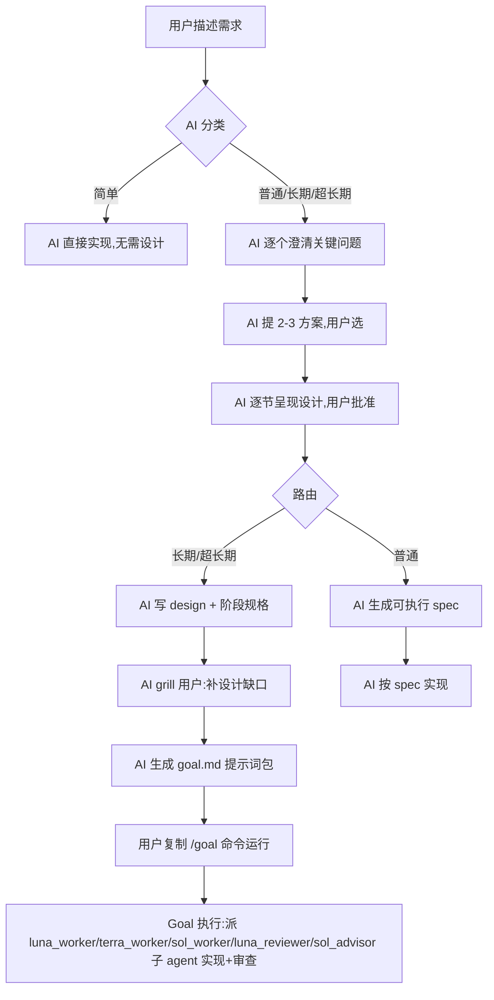
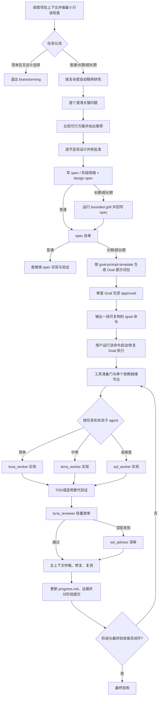

# Brainstorming Goal

> 📖 English version: [README.md](README.md) ｜ 中文版：本页

面向 AI 编程代理的可执行设计与长期 Goal 工作流。它以 Superpowers 的 `brainstorming` 为基础，针对数小时、数天乃至数周的复杂开发任务，补充可恢复执行、阶段化规格、对抗审查、工具准备、证据治理和上下文压缩恢复能力。


核心分工很简单：**brainstorming 阶段负责读取输入、联网研究、澄清决策并生成可执行 spec；Goal 阶段只执行已经审查通过的 spec。** 普通任务止于一份可执行 spec；长期/超长期任务额外产出 `design.md`（任务规范根）和 `goal.md`（一整段可复制提示词），后者在执行时按任务形状派遣 `luna_worker`/`terra_worker`/`sol_worker`/`luna_reviewer`/`sol_advisor` 五档子 agent（luna_reviewer 为轻量首审）。用户不需要手工拼接 plan、runbook 或提示词，长期路线结束时只需复制 AI 生成的整段 Goal。

## 安装

技能本体在仓库内层 `brainstorming-goal/brainstorming-goal/`，技能名固定 `brainstorming-goal`（与 `SKILL.md` frontmatter 同名，勿改成 `brainstorming`，可与原 `superpowers:brainstorming` 共存）。两步安装：① 装技能本体到 skills 目录；② 装 5 个子 agent 到 agents 目录。

### ① 技能本体

**Codex 用户级（PowerShell）**：
```powershell
git clone https://github.com/foursmile/brainstorming-goal.git
Copy-Item -Recurse -Force .\brainstorming-goal\brainstorming-goal "$env:USERPROFILE\.codex\skills\brainstorming-goal"
```

**项目级（PowerShell）**：
```powershell
New-Item -ItemType Directory -Force .agents\skills | Out-Null
Copy-Item -Recurse -Force .\brainstorming-goal\brainstorming-goal .agents\skills\brainstorming-goal
```

**macOS / Linux**：
```bash
git clone https://github.com/foursmile/brainstorming-goal.git
cp -R ./brainstorming-goal/brainstorming-goal ~/.codex/skills/brainstorming-goal
```

### ② 子 Agent

5 个子 agent 配置在 `agents/` 下，需复制到 Codex 的 `agents/` 目录才被识别：

| agent | 模型 | 角色 | sandbox |
|---|---|---|---|
| `luna_worker` | gpt-5.6-luna, max | 简单探索/搜索/文档/简单实现 | workspace-write |
| `terra_worker` | gpt-5.6-terra, high | 中等单模块实现/测试/常规分析 | workspace-write |
| `sol_worker` | gpt-5.6-sol, max | 高难度实现/跨模块变更/风险迁移 | workspace-write |
| `luna_reviewer` | gpt-5.6-luna, max | 简单节点轻量首审 | read-only |
| `sol_advisor` | gpt-5.6-sol, high | 复杂架构/安全/兼容审查与高影响决策 | read-only |

**Windows**：双击 `agents/install-subagents.bat`（自动复制 5 个 toml 到 `%USERPROFILE%\.codex\agents\` 并打印结果），或命令行：
```powershell
Copy-Item -Force .\brainstorming-goal\brainstorming-goal\agents\*.toml "$env:USERPROFILE\.codex\agents\"
```

**macOS / Linux**：
```bash
mkdir -p ~/.codex/agents
cp ./brainstorming-goal/brainstorming-goal/agents/*.toml ~/.codex/agents/
```

安装后重启 Codex 或新建任务使技能/agent 被发现。agent 名与 `SKILL.md` 子 Agent 模型路由、`goal-prompt-template.md` 派遣契约一致。

### 已知问题：`luna_worker` spawn 报 Unknown model

新会话派 `luna_worker`（`gpt-5.6-luna`）可能报 `Unknown model 'gpt-5.6-luna' for spawn_agent`（可用模型只有 sol/terra）——luna 在该会话未激活。**Workaround**（每次新会话开始时）：

1. 切换模型为 **luna**（`/model gpt-5.6-luna`）；
2. 发一句 `hi` 跑一轮对话，激活 luna；
3. 切换回 **sol-high** 作主模型；
4. 进入 brainstorming-goal 流程。激活后 `luna_worker`/`luna_reviewer` 不再报错；`terra_worker`/`sol_worker`/`sol_advisor` 用 terra/sol，本就可用。


## 用户调用流程

下图只突出**与用户交互的环节**和 **Goal 产物**（完整内部流程见下方[完整工作流](#完整工作流)）：



带 `用户`/`U` 前缀的节点是用户参与环节；`goal.md` 是长期/超长期交付物（用户复制即可运行）。普通任务止于 spec，AI 直接实现。

## 解决什么问题

普通 brainstorming 擅长在编码前澄清需求和设计，但超长任务还会遇到另一组问题：

- 简单修改也被迫走完整设计流程，造成额外开销；
- 外部资料检索发生得太晚，没有真正影响架构和 spec；
- 设计文档与实施计划重复，二者容易漂移；
- 大任务缺少阶段边界、架构门、进展记录和恢复入口；
- 上下文压缩后，代理可能重复提问、丢失下一步或重新执行昂贵操作；
- 子 Agent 的报告未经独立验证就被当成事实；
- 工具能力不足时直接猜测结果，或在同一失败假设上重复重试；
- “完成、正确、一致、无损”等目标没有被转换成可验证证据；
- 长期执行中状态汇报过多，消耗上下文和输出 Token。

本技能把 brainstorming 从一次性的设计对话扩展为一条按任务规模分流的可执行设计链路，同时保留一个原则：**有设计决策时先设计，简单任务立即退出。**

## 相比原始 brainstorming 改进了什么

| 维度 | 原始常见流程 | 本项目流程 |
| --- | --- | --- |
| 简单任务 | 都进设计流程 | 明确的低风险机械任务立即退出，不主动调用本技能，除非用户显式要求 |
| 外部研究 | 实现阶段临时搜 | 分类后按复杂度自动联网（不问用户），研究证据回写 spec 后再冻结设计 |
| 文档结构 | 设计后另生 plan | spec 本身包含有序实施步骤，禁止再创建独立 plan 文档 |
| 长任务拆分 | 单份设计文档 | 按需求、依赖和审查边界生成 phase specs，再生成 design spec |
| 长任务目录 | 产物散在多根目录 | design.md 收入 `task_key/` 任务目录内（与 goal.md 同目录），普通 `*-design.md` 仍平铺 `specs/` 根；运行时记录只有 `goal.md` 旁单个 `progress.md` |
| 大模块设计 | 直接分任务编码 | 先通过架构先行门，再冻结模块合同并进入节点开发 |
| 需求追问 | 普通问答 | 阶段规格和 design 草案完成后才运行 bounded grill；grill 完成后才进入 spec 自审和 Goal 审查 |
| 子 Agent | 通用执行 | 五档全名路由：简单→`luna_worker`、中等→`terra_worker`、高难度实现→`sol_worker`、轻量首审→`luna_reviewer`(只读)、复杂审查/决策→`sol_advisor`(只读)；各档按角色定制停止条件与升级路径，主上下文负责集成与最终验收 |
| Review | 末尾才审查 | 核心节点、阶段和最终验收分层审查；修复、复测、再审后才能继续 |
| 上下文恢复 | 靠对话历史 | 用 `progress.md` 单文件恢复精确下一步，无额外运行时目录 |
| 工具不足 | 临时处理 | 先过 tool-readiness gate；必要时检索或实现最小 MCP/等效能力 |
| 证据 | 测试通过即可 | 记录输入、版本、环境、命令、路径、哈希和失效条件，避免复用过期证据 |
| 长期专注 | 靠不断提醒 | PUA 自身按场景触发（失败 2+ 次等）；本技能另加每 20 分钟周期聚焦校准（安全边界、活动命令/测试/审查期间暂停、恢复后补检），无变化时静默 |
| Goal 生成 | 手工拼模板 | AI 根据已审查 spec 生成一整段任务专属 Goal，并按用户输入语言生成（中文提问→简体中文；否则英文） |
| 用户审阅 | 等用户审阅 | 不设用户审阅门禁；写完 spec/Goal 包后直接进入自审与实现 |

## 任务分流

技能先做最小的只读检查，然后按可观察范围选择路线：

| 路线 | 判断条件 | 产物 |
| --- | --- | --- |
| Simple exit | 目标清晰、局部、低风险、没有实质设计选择 | 退出本技能，进入正常实现与验证 |
| Ordinary design | 存在有意义的设计选择，通常约两小时内完成 | 一份可执行 spec |
| Long Goal | 超过两小时、跨需求边界、需要中断恢复或多个有界 Agent | phase specs、design spec、精简 Goal 包 |
| Ultra-long Goal | 持续数天或数周、昂贵基线、长期进程、大型清单或复杂证据链 | Long Goal 产物加更强阶段证据与审查治理（工作项清单/工具探测/确定性比较/长进程监控/阶段退出第二遍检查） |

时间只是信号。公开接口、安全、数据迁移、兼容性和不可逆操作，即使代码很少，也不能按简单任务处理。

## 子 Agent 路由

长期/超长期 Goal 执行时，主上下文按任务形状派遣子 agent，各档角色不同、升级路径明确：

| 任务形状 | agent | 模型 | 角色 |
|---|---|---|---|
| 简单探索/搜索/文档/简单实现 | `luna_worker` | gpt-5.6-luna, max | 快速闭合简单包，最小 diff；超出简单则交回 |
| 中等单模块实现/测试/常规分析 | `terra_worker` | gpt-5.6-terra, high | 聚焦单模块；跨模块/高难度则升级 sol |
| 高难度实现/跨模块变更/风险迁移 | `sol_worker` | gpt-5.6-sol, max | 谨慎改、保兼容；超包/不可逆则停并带证据上报 |
| 简单节点轻量首审 | `luna_reviewer` | gpt-5.6-luna, max | **只读**，查常识bug/边界/静态泄漏/重复接口/测试/过大/性能UIUX/整理；深层升级 sol_advisor |
| 复杂架构/安全/兼容审查与高影响决策 | `sol_advisor` | gpt-5.6-sol, high | **只读**，给决策建议与证据，不实现 |

三 worker（luna/terra/sol）共享停止条件：需求模糊、接口/依赖意外变更、安全或数据完整性影响、验证不可用、范围扩大、两次失败——则停并返回证据，不强行。`luna_reviewer` 和 `sol_advisor` 只读，返回发现/建议+证据，绝不声称实现；`luna_reviewer` 深层发现升级 `sol_advisor`。主上下文拥有集成与最终验收，检查实际 diff 与验证结果，不接受仅凭摘要。不可用模型/通道记 `agent_unavailable`，回退或主上下文，绝不伪造。

五档 agent 名与 `SKILL.md` 子 Agent 模型路由、`goal-prompt-template.md` 派遣契约一致；安装见下方[子 Agent 安装](#子-agent-安装跨平台)。

## 完整工作流



### 1. 上下文与分流

读取用户指令、仓库规则、相关源码、文档和近期变更，只获取足以判断路线的信息，避免在普通任务中提前加载长期工作流的全部参考文件。

随后做最小只读检查并按可观察范围分流到 Simple exit / Ordinary / Long / Ultra-long。简单、明确、低风险的机械任务不主动调用本技能，除非用户显式要求。

### 2. 联网研究门（brainstorming 阶段）

完成最小只读检查和任务分流后，立即按任务复杂度决定是否联网：

- 探索性、开放性、冷门、新兴、时效性、不确定或明确要求外部参考的任务，在澄清和设计起手阶段检索权威资料；
- 中大型任务在架构、phase specs 和 design spec 冻结前检索 GitHub 上维护中的同类框架、库、工具、测试设施或参考仓库；
- 简单、稳定、本地任务不为形式而联网，记录 `research_not_required` 后继续。

每项检索必须进入 external evidence ledger，至少记录问题、URL/仓库、版本或 commit、访问时间、结论及局限、许可证/安全/维护/版本适配、采用或拒绝理由、验证动作和失效条件。**研究证据回写 spec**、design 和 traceability，并重新审查被外部证据改变的设计决策。模型已有知识只能作为待验证假设，不能声称读取或汇总模型训练权重。

Goal 只执行已审查的 spec，不重新承担一轮联网研究；只有 spec 明确声明运行时研究任务时，Goal 才按该步骤执行。

### 3. 形成可执行设计

仍有设计空间时，每次只问一个关键问题，优先给出可选择答案及其后果。随后比较两到三个真正可行的方案，说明推荐理由和 YAGNI 取舍。

普通任务生成一份 executable spec，其中直接包含：

- 目标、范围、非目标和约束；
- 架构、模块、接口、状态流、错误和兼容策略；
- 带目标文件或发现规则的有序实施步骤；
- TDD 或适用的替代验证方法；
- 命令、预期结果、证据位置、回滚条件和完成标准。

spec 通过自检后直接进入开发，不再生成 writing-plans 文档。

### 4. 长任务按阶段设计

Long Goal 和 Ultra-long Goal 按需求、依赖和 Review 边界拆分 phase spec，而不是按文件数量平均切块。design spec 汇总端到端架构、阶段顺序、接口合同、验收映射和恢复规则，并成为实施阶段的规范事实源。

每个长期任务使用一个稳定的 `task_key = YYYY-MM-DD-<topic>`：

```text
docs/superpowers/specs/
└── YYYY-MM-DD-<topic>/
    ├── design.md
    ├── goal.md
    ├── phases/
    └── progress.md (optional runtime record)
```

design 和任务目录必须使用同一个 `task_key` 并互相记录路径和版本。同名任务优先增加人类可读的范围词，没有语义差异时再使用 `-02` 这类简单序号；创建日期和目录名在后续修改中保持稳定。`<topic>` 使用稳定、可读、无路径分隔符的短主题名（允许中文、字母、数字和连字符），不得使用保留目录名或仅靠随机字符区分。文件名和目录名禁止加入 CRC、SHA、UUID 或随机短码。哈希只在需要检测内容漂移或验证证据完整性时作为文档元数据保存。`design.md` 与任务目录同级、收入 `task_key/` 内，方便发现；普通 `*-design.md` 仍平铺在 `specs/` 根目录；阶段 spec、Goal 和运行记录则不会污染根目录。运行时记录只有 `goal.md` 旁单个可选 `progress.md`，不创建额外的运行时目录或账本子树。

每个大模块编码前必须通过架构先行门：

- 先明确模块边界、依赖方向、状态流、扩展点、资源上限、故障隔离、可观测性和回滚；
- 使用起手研究门已经形成的 GitHub/权威资料证据；发现新的承重未知项时返回研究门并更新 spec；
- 禁止形成单一超大文件或超大函数，按职责和变化节奏维持高内聚、低耦合；
- 采用阶段门推进：架构基线 → 合同冻结 → 核心节点 → 节点审查 → 模块集成和压力验证 → 阶段交付。

### 5. Design Spec 缺口审问

**设计意图**：brainstorming 前段的"提 2-3 个方案"是**模糊流程**——需求未定时，针对模糊需求提方案让用户选，澄清方向。而 grill 是**模糊流程经模型设计后**的精化——设计草案（phase specs + design draft）出来后，对**设计过程中暴露的语义缺口**让用户逐一回答。两者都问用户，但时机和对象不同：提方案在设计前、对象是"走哪条路"；grill 在设计后、对象是"设计里哪些没定清"。普通设计不跑 grill；长期/超长期才在写完设计文档后跑。

phase specs 和 design draft 完成后运行 design 缺口访谈（内联于 SKILL 的 Long/Ultra Goal extension；本地不再单独分发 grillme-with-docs 文件，但保留对 mattpocock/skills 上游仓库的引用与协议声明）。它不是普通 brainstorming 的前置步骤，也不是让用户通读整份文档。

它只追问会改变以下内容的缺口：行为、范围、权限、不可逆决策、依赖、验收标准或 blocker。每个回答立即更新 design、受影响的 phase spec、决策记录和追踪关系。

- 一次只问一个问题；
- 默认最多 12 个问题；
- 已回答的问题不重复询问；
- 没有实质缺口时走零问题路径；
- 无法回答的承重问题保持 `blocked`，不得偷偷补默认值。

### 6. Goal 包与执行循环

长期路线生成：

- `<task_key>/design.md`：任务规范根，汇总端到端架构、阶段顺序、接口合同、验收映射与恢复规则；
- `<task_key>/goal.md`：用户用于创建或恢复长期 Goal 的整段提示词；
- `<task_key>/progress.md`：唯一运行时记录，精简的实时状态和下一条证据产生命令；仅在需要跨中断持久化时创建，不建额外目录。

长期执行发生冲突时按固定事实源优先级处理：当前用户指令和仓库规则 → 已审查 design spec → 适用的 phase spec → 可选的 `progress.md`。低层记录不能静默修改高层规范；实现发现规范缺陷时，要回写受影响 spec、更新 traceability、审查差异后再恢复执行。

`references/goal-prompt-template.md` 虽保留历史文件名，但它不是可直接复制的固定提示词，而是生成与审查契约。阶段规格和 design spec 写好、bounded grill 完成、spec 自审通过后，AI 才按该契约生成目标任务专属的 Goal 提示词包；`goal.md` 按用户输入语言生成（中文提问→简体中文；否则英文）。主上下文仲裁并修复全部有效问题、审查至 `approved` 后，才产出用户真正运行的 Goal。Goal 不复制整份 design，也不凭通用模板增加当前任务没有的门禁。候选 Goal 不会启动或恢复任务；只有既有明确授权覆盖未变范围，或用户明确发出一次启动/恢复指令后，才可开始执行。

最终产物是一整段可直接复制的 Goal 提示词。它必须内嵌已经解析好的启动文件清单、可移植路径解析规则和读取顺序；用户不需要再手动拼接绝对路径或替换占位符。生成前的 brainstorming 输入读取门与 Goal 启动/恢复时的 source set 是两个独立阶段。

生成阶段还要维护 requirement-to-proof 覆盖关系：每个适用规范条目都映射到 Goal 规则、实现目标、验证、Review、证据和终态；缺少映射时记录 `coverage_gap`。`task_key`、路径、版本或哈希变化属于 identity drift，必须先停下比较、修复 design 与任务目录的双向链接并重新审查。任务 spec 可以增加更严格的 Review、证据、工具、UX 或交付门禁，但不能降低技能的安全和授权边界；验收要求真实 UI、截图、外部效果或当前证据时，不得降级为 mock、静态页面、headless smoke、合成结果或旧工件。

Long Goal 和 Ultra-long Goal 的实际 Goal 必须包含原始技能启用条款：启动前从当前安装的技能目录读取 `references/caveman/SKILL.md` 和 `references/pua/SKILL.md`。PUA 自身按场景触发（失败 2+ 次等）；本技能另加每 20 分钟周期聚焦校准——只在安全命令/工具边界执行，活动命令/测试/审查期间暂停，恢复后补检一次。不维护派生 profile、绝对机器路径、版本或 SHA-256 登记。

实际 Goal 不复制或重写 Caveman/PUA 内容，也不要求用户手工替换绝对路径；技能目录随安装位置解析，复制到其他机器或项目仍可使用。中长期 Goal 默认激活 Caveman；两份技能只影响表达和专注，不能覆盖用户/仓库规则、spec、授权、证据、重试上限、阻塞或终态。

每轮只实现一个依赖就绪的核心节点。行为变更遵循 RED → GREEN → REFACTOR；诊断、文档、基线、外部操作等使用 phase spec 声明的替代验证模式。

节点完成后按以下闭环执行：

1. 保存实际 diff、测试和证据；
2. 让独立、上下文最小的 Reviewer 做对抗审查（含：代码是否过度膨胀、能否更简洁表达、可否复用现有实现）；
3. 主上下文对每个问题作出修复、证据驳回、授权例外或 blocker 仲裁；
4. 修复后执行范围明确的复测和必要的再审；
5. 更新可选 `progress.md`、证据身份；
6. 按仓库规则进行一次阶段性提交，不绑定 Git、SVN 或其他特定工具；
7. 通过 exit gate 后才进入下一节点或下一阶段。

独立 Reviewer 不可用时，低/中风险节点可用保存输入的独立第二遍审查替代，并记录 `review_substitute`；高风险且明确要求独立上下文的门禁必须记录 `review_unavailable` 并保持阻塞，不能伪造独立审查。

### 7. 工具准备和证据治理

依赖抓取、比较、诊断、性能分析或报告能力的阶段，必须先通过 tool-readiness gate：

1. 定义验收需要的输出合同；
2. 探测现有工具和仓库内能力；
3. 能力不足时，查询维护中的 MCP、等效工具、权威文档或公共源码；
4. 只采用或实现满足真实验收需求的最小能力；
5. 运行 capability probe 或 contract test；
6. 记录版本、限制、故障模式、安全与许可证影响。

同一问题多次失败并不自动授权无限重试或扩展范围。达到重试上限后必须停止相同假设，记录事实、排除项、blocker、解除条件和下一种能够产生新证据的假设。

### 8. 上下文压缩与恢复

上下文压缩或任务中断后，不依赖对话记忆重新猜测进度，而是依次读取：

1. 仓库规则；
2. design 当前版本；
3. 可选的 `progress.md`（运行时记录）；
4. 已记录的下一条命令及前置条件。

如果持久化记录互相冲突，先按来源优先级修复状态，再继续实现。已经回答的问题和已经处理的插队消息不会在自动续跑中再次回应。

### 9. Ultra-long 扩展

持续数天或数周的任务会进一步管理：

- 可复现 baseline；
- 完整工作项 inventory（含稳定 ID、范围、依赖、验证、证据、风险和终止状态）；
- 显式授权和写入范围（允许、仅测试、只读、生成、外部与禁止目标）；
- requirement → implementation → validation → review → evidence 的 traceability；
- 工具能力记录与证据索引（作为显式链接的支持性记录）；
- 昂贵基线的身份、哈希和失效条件；
- 长期进程的健康探针、观察窗口和恢复命令；
- 每个阶段退出的独立第二遍检查；
- 最终完整性验证与未闭环项扫描。

实现状态与证据状态始终分离。代码写完但证据缺失或过期时，状态只能是 `unverified`，不能通过文字升级为“完成”。

## 如何使用

当需求包含未解决的行为、架构、兼容性、UX 或其他实质设计权衡时，直接描述目标和约束即可。例如：

```text
请设计并实施这个功能。预计需要多天完成，中间可能中断，
希望完成后能自动从上次进度继续。
```

对于明确、低风险、机械化的修改，无需主动调用本技能；它会走 Simple exit。

长期路线完成设计后，AI 会输出一整段已经解析真实路径、版本和启动顺序的 Goal。用户直接复制整段 Goal 创建任务即可，不需要从 README、spec 或模板中自行组装提示词。

## 实际用例：迁移一个长期运行的任务调度平台

下面用一个通用但接近真实工程规模的例子说明完整用法。目标是不绑定语言或框架，把一个旧任务调度平台迁移到新架构，同时保持旧客户端兼容，预计三周完成。

### 用户输入

```text
我们要把现有任务调度平台迁移到新的可扩展架构，预计三周。
要求旧客户端继续可用；新架构支持水平扩展、失败恢复、任务幂等和压力测试；
不能一次改完，必须按模块推进。
```

### 技能如何处理

1. **分类为 Ultra-long Goal**：任务跨多周，包含兼容迁移、长期状态、压力证据和昂贵基线。
2. **起手联网研究**：在提出架构结论前检索维护中的同类调度框架和权威资料，记录版本、许可证、适配限制和采用/拒绝理由，并把结论写入研究账本。
3. **澄清承重决策**：结合仓库事实与联网证据，逐个确认旧协议支持范围、幂等定义、失败语义、容量目标、迁移回滚和验收证据。
4. **架构先行并形成阶段规格**：冻结模块边界、状态机、存储接口和故障恢复合同，再生成基线、合同、工具准备、调度内核、兼容适配、迁移与最终验收等 phase specs。
5. **生成 design spec**：把每个需求映射到实现节点、测试、Reviewer、证据和状态，并纳入研究结论和失效条件。
6. **运行 bounded grill**：发现“任务重复执行容差”和“旧客户端弃用边界”仍不明确，逐项向用户提问并立即回写相关 spec。
7. **运行 bounded grill 并自审**：grill 完成回写后做 spec 自审；再按 `goal-prompt-template.md` 契约生成按用户输入语言的 Goal prompt，审查至 `approved`；用户只复制最终整段 Goal。
8. **按节点执行**：先为幂等状态转换写失败测试，再实现最小逻辑；独立 Reviewer 检查竞态、兼容性和资源释放；主上下文修复并复测。
9. **记录并提交阶段结果**：把证据身份、Review 结论、下一条命令写入可选 `progress.md`，然后按仓库规则做阶段提交。
10. **中断后恢复**：新上下文按事实源优先级读取持久化文档，确认上一个节点已经通过审查，从下一条压力测试命令继续，不重新抓取未失效的基线。
11. **最终验收**：逐项核对旧客户端兼容、任务幂等、故障恢复、容量指标、资源使用、迁移回滚和所有 inventory ID；缺少当前证据的项目保持 `unverified`。

### 预期产物示例

```text
docs/superpowers/specs/
└── 2026-08-02-task-platform/
    ├── design.md
    ├── goal.md
    ├── phases/
    │   ├── phase-01-baseline.md
    │   ├── phase-02-contracts.md
    │   └── phase-03-core.md
    └── progress.md (optional runtime record)
```

文件名只是示例；实际路径、日期格式和文档元数据始终服从目标仓库规则。不同 Goal 必须使用唯一且人类可读的 `task_key`，不能复用其他任务的目录，也不使用 CRC/哈希制造唯一性。运行时记录只有 `goal.md` 旁单个可选 `progress.md`，不建 `progress/` 子目录或账本树；工作项清单、决策记录、可追溯性、证据索引等作为 spec 内章节或显式链接的支持性记录，而非强制目录。

## 目录结构

```text
brainstorming-goal/
├── SKILL.md
├── SKILL_ch.md
├── agents/
│   ├── openai.yaml
│   ├── luna_worker.toml
│   ├── terra_worker.toml
│   ├── sol_worker.toml
│   ├── luna_reviewer.toml
│   ├── sol_advisor.toml
│   └── install-subagents.bat
├── references/
│   ├── long-goal-workflow.md
│   ├── ultra-long-goal-workflow.md
│   ├── goal-prompt-template.md（目标 Goal 生成与审查契约，非固定模板）
│   ├── caveman/
│   └── pua/
└── spec-document-reviewer-prompt.md
```

## 发布前检查

- 确认目录名与 `SKILL.md` 的 `name` 策略一致；
- 确认 `agents/openai.yaml` 的 `display_name` 为 `Brainstorming Goal`；
- 不提交 `__pycache__/`、`*.pyc`、日志、`.superpowers/` 运行目录或编辑器缓存；
- 记录第三方来源的具体版本或 commit，并更新第三方声明；
- 确认 `caveman`、`pua` 原始技能文件随本技能一起分发，并在 Goal 启动时从当前技能目录读取；不要复制为派生 profile 或写死机器路径；
- 为 shell 脚本保留 executable 位；
- 用全新上下文分别验证 Simple、Ordinary、Long 和 Ultra-long 路线；
- 发布前人工检查完整 diff，不把本机缓存、私有路径、密钥或真实项目数据带入仓库。

## 参考来源与派生关系

本仓库是社区派生项目，不是 Superpowers、Matt Pocock Skills、Caveman 或 PUA 的官方组成部分，也不代表这些上游项目的维护者立场。

| 来源 | 本项目参考的核心能力 | 本项目的主要调整 |
| --- | --- | --- |
| [obra/superpowers](https://github.com/obra/superpowers) | brainstorming 的需求澄清、方案比较、设计批准，以及 TDD、审查和验证理念 | 增加简单任务退出、长期 Goal 分流、取消独立 writing-plans 阶段、直接从可执行 spec 开发 |
| [mattpocock/skills](https://github.com/mattpocock/skills) 的 [grill-with-docs](https://github.com/mattpocock/skills/blob/main/docs/engineering/grill-with-docs.md) | 通过逐问访谈暴露设计和文档中的语义缺口 | 简化核心规则内联进 SKILL 的 Long/Ultra Goal extension（Design gap grill 节），只在 design spec 草案完成后运行；最多 12 问，每次回答立即回写 spec，允许零问题路径；上游仓库引用保留（见左列链接与 [THIRD_PARTY_NOTICES.md](THIRD_PARTY_NOTICES.md)），只是本地不再单独分发 grillme-with-docs 文件 |
| [JuliusBrussee/caveman](https://github.com/JuliusBrussee/caveman) | 为中长期 Goal 默认提供紧凑表达 | Long/Ultra Goal 启动时读取技能副本中的原始文件并默认激活；`normal mode`/`stop caveman` 可退出，不维护派生 profile |
| [tanweai/pua](https://github.com/tanweai/pua) | 在重复失败、被动等待和过早放弃时重新聚焦问题 | Long/Ultra Goal 启动时读取技能副本中的 SKILL.md；PUA 自身按场景触发（失败 2+ 次等），本技能另加每 20 分钟周期聚焦校准（安全边界、活动命令/测试/审查期间暂停、恢复后补检），不维护派生 profile |

详细版权、许可证状态和第三方文件范围见 [THIRD_PARTY_NOTICES.md](THIRD_PARTY_NOTICES.md)。

## 许可证

本项目自身代码使用根目录 [LICENSE](LICENSE) 中的 MIT License。来源文件和派生内容仍保留各自上游版权与许可证要求，详见 [THIRD_PARTY_NOTICES.md](THIRD_PARTY_NOTICES.md)。
