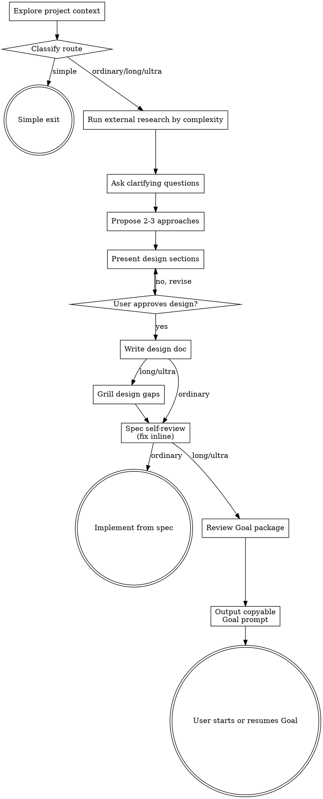

# Brainstorming Ideas Into Designs

Help turn ideas into fully formed designs and specs through natural collaborative dialogue.

Start by understanding the current project context, then ask questions one at a time to refine the idea. Once you understand what you're building, present the design and get user approval. Scale the workflow to the task and route by observable scope; for long or ultra-long work, use the Goal extension in place of a separate plan.

<HARD-GATE>
Do NOT invoke any implementation skill, write any code, scaffold any project, or take any implementation action until you have presented a design and the user has approved it. This applies to EVERY project regardless of perceived simplicity. Long/Ultra approval permits package and review work only; then hand off `/goal`. Implementation requires explicit start/resume of that unchanged Goal.
</HARD-GATE>

## When to use this skill

Do not proactively invoke this skill for simple requests with an explicit, unambiguous need — a one-line fix, a typo, a config value change, or a single utility function with no design choice. For those, go directly to implementation and verification. Invoke this skill only when there is unresolved scope, behavior, architecture, UX, or a meaningful design trade-off — or when the user explicitly calls it.

A small diff is not automatically simple, though: public API, security, schema/data migration, compatibility, irreversible operation, and unclear bug-fix decisions remain design or diagnostic work. Route those via the flow below.

## Route by observable scope

Classify after the smallest useful read-only inspection. Duration is a signal, not the only criterion.

| Route | Observable conditions | Required output |
|---|---|---|
| **Simple exit** | Clear outcome; localized, low-risk mechanical change; no material design choice or missing information | Leave this skill and use the normal implementation/verification workflow |
| **Ordinary design** | One coherent behavior or component; meaningful design choice; normally executable within about two hours | One executable spec |
| **Long Goal** | Expected work exceeds two hours, crosses requirement boundaries, needs interruption-safe continuation, or benefits from multiple bounded agents | Phase specs, design spec, lean Goal package |
| **Ultra-long Goal** | Multi-day/week work, costly baselines, long-lived processes, large completeness inventory, repeated tool-assisted comparisons, or durable evidence | Long Goal outputs plus stronger phase evidence and review governance |

### Simple exit

When every simple condition holds, stop this skill immediately. Do not ask design questions, propose approaches, write a spec, or request approval. If inspection later exposes a meaningful choice, return here and select the appropriate design route before editing.

### Ultra-long extra controls

Ultra-long Goal adds controls beyond Long Goal — these are summarized here and detailed in `references/ultra-long-goal-workflow.md`: keep a complete work-item inventory (each item has stable ID, scope, dependency, implementation target, validation, evidence, risk, terminal status); probe every required tool and evidence path before dependent work; use deterministic comparison for expensive evidence; monitor long-lived processes with bounded waits, health checks, and cleanup (never blind waits); preserve interruption safety through `progress.md`; and run an independent second pass at each phase exit when design risk requires it.

## Checklist

Create a task only for each applicable step after classification; never create placeholder tasks for skipped routes.

1. **Explore project context** — check files, docs, recent commits.
2. **Classify route** — Simple exit, Ordinary design, Long Goal, or Ultra-long Goal after the smallest read-only inspection.
3. **Run external research by complexity** — automatically, after classification and before clarifying questions, freezing architecture, phase specs, or the design spec. The model decides research depth from complexity on its own (it does not ask the user): exploratory/niche/emerging/uncertain or medium-large work searches current web/GitHub evidence and feeds it into the spec; simple stable local work records `research_not_required` and proceeds. See the External research and reuse section for the triggers and the evidence record to keep.
4. **Ask clarifying questions** — one at a time, understand purpose/constraints/success criteria.
5. **Propose 2-3 approaches** — with trade-offs and your recommendation.
6. **Present design** — in sections scaled to their complexity, get user approval after each section.
7. **Write design doc** — Ordinary: save one executable spec to `docs/superpowers/specs/YYYY-MM-DD-<topic>-design.md` and commit. Long/Ultra: write phase specs and the design spec, then run the design gap grill (see Long/Ultra Goal extension) and fold every answer back into the specs; only after the grill is complete do you proceed to self-review and Goal generation. Do not create a separate implementation-plan file for any route.
8. **Spec self-review** — quick inline check for placeholders, contradictions, ambiguity, scope; for Long/Ultra also verify every phase has a stable ID, exact reciprocal path/version, and requirement-to-phase traceability in the design doc.
9. **Deliver & transition to implementation** — Ordinary: implement directly from the executable spec after required authorization; do not invoke writing-plans. Long/Ultra: only after self-review passes, generate the Goal prompt package by following `references/goal-prompt-template.md` as a contract (its fidelity gate, template coverage map, and review rules — not as a loose suggestion), write `goal.md` in the user's input language (Chinese input → Simplified Chinese; otherwise English), review it to `approved`, then output exactly one `/goal "<resolved goal.md>"` command and stop; the user runs it to start/resume the Goal, and implementation starts only from that explicit start/resume of the unchanged Goal.

## Process Flow



**The terminal state is direct implementation from spec (Ordinary) or `/goal` handoff (Long/Ultra); Simple exit leaves the skill earlier for the normal implementation/verification workflow.** Do NOT invoke writing-plans, frontend-design, mcp-builder, or any other implementation skill from brainstorming. For Long/Ultra the deliverable is the copyable Goal prompt itself (`goal.md`): after review and `approval`, output exactly one `/goal "<absolute-path-to-goal.md>"` command and stop; the user runs it to start/resume the Goal, and implementation starts only from that explicit start/resume of the unchanged Goal.

## The Process

**Understanding the idea:**

- Check out the current project state first (files, docs, recent commits).
- Before asking detailed questions, assess scope: if the request describes multiple independent subsystems (e.g., "build a platform with chat, file storage, billing, and analytics"), flag this immediately. Don't spend questions refining details of a project that needs to be decomposed first.
- If the project is too large for a single spec, help the user decompose into sub-projects: what are the independent pieces, how do they relate, what order should they be built? Then brainstorm the first sub-project through the normal design flow. Each sub-project gets its own spec → implementation cycle (Ordinary), or spec → Goal package cycle (Long/Ultra).
- For appropriately-scoped projects, ask questions one at a time to refine the idea.
- Prefer multiple choice questions when possible, but open-ended is fine too.
- Only one question per message - if a topic needs more exploration, break it into multiple questions.
- Focus on understanding: purpose, constraints, success criteria.

**Exploring approaches:**

- Propose 2-3 different approaches with trade-offs.
- Present options conversationally with your recommendation and reasoning.
- Lead with your recommended option and explain why. When only one approach satisfies binding constraints, do not manufacture alternatives.

**Presenting the design:**

- Once you believe you understand what you're building, present the design.
- Scale each section to its complexity: a few sentences if straightforward, up to 200-300 words if nuanced.
- Ask after each section whether it looks right so far.
- Cover: architecture, components, data flow, error handling, testing.
- Be ready to go back and clarify if something doesn't make sense.

**Design for isolation and clarity:**

- Break the system into smaller units that each have one clear purpose, communicate through well-defined interfaces, and can be understood and tested independently.
- For each unit, you should be able to answer: what does it do, how do you use it, and what does it depend on?
- Can someone understand what a unit does without reading its internals? Can you change the internals without breaking consumers? If not, the boundaries need work.
- Smaller, well-bounded units are also easier for you to work with - you reason better about code you can hold in context at once, and your edits are more reliable when files are focused. When a file grows large, that's often a signal that it's doing too much.

**Working in existing codebases:**

- Explore the current structure before proposing changes. Follow existing patterns.
- Where existing code has problems that affect the work (e.g., a file that's grown too large, unclear boundaries, tangled responsibilities), include targeted improvements as part of the design - the way a good developer improves code they're working in.
- Don't propose unrelated refactoring. Stay focused on what serves the current goal.

## External research and reuse

Run the research gate after the smallest read-only inspection and route classification, before finalizing questions, architecture, phase specs, or the design spec:

- **Exploratory/open-ended research:** start web research at the beginning of brainstorming when the problem is niche, emerging, time-sensitive, uncertain, or explicitly asks for external references. Use current authoritative documentation and dated sources to turn unknowns into design decisions.
- **GitHub framework/repository research:** for medium/large routes, search GitHub before architecture or design-spec freeze for maintained, compatible frameworks, libraries, tools, test harnesses, and reference repositories that could reduce risk or cost. Compare alternatives before choosing to build or reuse.
- **Simple stable local route:** do not browse merely for ceremony; record `research_not_required` and continue.

For every search, record an external evidence record: question, source URL/repository, version/commit, date, claim, confidence/limits, license/security/maintenance/version fit, decision, validation, and invalidation condition. Feed it into the applicable spec and traceability; review changed decisions before approval. Treat model knowledge as a hypothesis; never claim to inspect or merge model weights.

The generated Goal consumes these reviewed artifacts. It does not start a new research phase unless the approved spec explicitly defines a runtime research action.

## After the Design

**Documentation:**

- Ordinary: write one executable spec to `docs/superpowers/specs/YYYY-MM-DD-<topic>-design.md`, unless repository or user rules choose another location, and commit it. It contains: objective, scope, non-goals, governing constraints, approved decisions; architecture, units, interfaces, data/state flow, errors, compatibility, authority boundaries; ordered implementation steps with target files or discovery rules; applicable TDD or alternate validation method, commands, expected results, acceptance evidence; rollback/blocker conditions and completion criteria.
- Long/Ultra: write phase specs and the design spec under the long-task artifact layout, then prepare the Goal package (see Long/Ultra Goal extension). Do not create a separate implementation-plan file for any route.
- Use elements-of-style:writing-clearly-and-concisely skill if available.
- Commit the design document(s) to git.

**Spec Self-Review:**
After writing the spec document (or, for Long/Ultra, the design draft after the grill has folded answers back in), look at it with fresh eyes:

1. **Placeholder scan:** Any "TBD", "TODO", incomplete sections, or vague requirements? Fix them.
2. **Internal consistency:** Do any sections contradict each other? Does the architecture match the feature descriptions? For Long/Ultra, does every phase file have a stable ID, exact reciprocal path/version, dependency and entry/exit gates, and requirement-to-proof traceability in the design doc?
3. **Scope check:** Is this focused enough for a single implementation, or does it need decomposition?
4. **Ambiguity check:** Could any requirement be interpreted two different ways? If so, pick one and make it explicit.

Fix any issues inline. No need to re-review — just fix and move on.

**User Review Gate:**
Do not ask the user to review the written spec or Goal package. There is no user review step; do not insert one.

**Implementation:**

- Ordinary: implement directly from the executable spec after required authorization. Do NOT invoke writing-plans or any separate plan skill. Invoke only needed implementation/diagnostic skills, then implement from the spec.
- Long/Ultra: after the Goal package is reviewed and `approved`, hand off exactly one copyable `/goal "<absolute-path-to-goal.md>"` command and end. Do NOT invoke writing-plans or any implementation skill from brainstorming. Implementation starts only from an explicit start/resume of that unchanged Goal.
- "continue" before handoff means finish/review the package, not source edits.

## Long/Ultra Goal extension

Long and Ultra-long routes use the Goal core process below in place of a single spec. Do not load these for Simple exit or Ordinary design.

### Long-task artifact layout

Use one canonical, human-readable `task_key`: `YYYY-MM-DD-<topic>`. The creation date remains stable. If that key already exists for another task, append a human-readable scope qualifier or a simple sequence such as `-02`. Never put a CRC, content hash, UUID, or random token in a file or directory name.

```text
docs/superpowers/specs/
└── YYYY-MM-DD-<topic>/
    ├── design.md
    ├── goal.md
    ├── phases/
    └── progress.md (optional runtime record)
```

`design.md` is the normative root for the Long/Ultra task, sitting beside `goal.md` in the task directory. `goal.md` is the generated copyable prompt, not a second design doc. Phase specs under `phases/` are the required execution decomposition. `progress.md` beside `goal.md` is the only runtime record, used when interruption state must persist.

### Design-phase contract gate

For every Long/Ultra Goal, the design doc is the normative root and must incorporate phase documents before approval/generation; a filename list is insufficient. It must contain: a stable phase ID for every phase; exact phase-document path, task key, design version, and reciprocal identity link; phase dependencies and ordered entry gates; phase inputs, outputs, allowed/test-only/read-only targets, and exit gates; requirement-to-phase traceability mapping each material requirement to implementation target, validation/evidence, review gate, and terminal status; and the staged read order, including predecessor evidence required before advancing `active_phase`. Compare every phase against this registry. Orphans, missing reciprocal links, version mismatches, absent traceability, or absent exit gates are `inconsistent` and block generation.

### Design gap grill

After phase specs and the design draft exist (Long/Ultra only), run a bounded gap interview before self-review and Goal generation. This is not a generic brainstorming prerequisite and not a request to proofread the document.

- **Inputs**: read the phase specs and design draft; build a gap table `gap_id | category | evidence | question | answer_needed_to_change | owner | status`, checking only relevant categories (outcome/scope, actors and permissions, data/state, invariants, interfaces, compatibility, failure/recovery, performance/resources, security, operations, migration, acceptance evidence, non-goals).
- **Question rules**: one targeted question per message; ask only when the answer changes behavior, scope, authority, an irreversible choice, a dependency, an acceptance criterion, or a blocker; order by load-bearing blockers, irreversible/authority decisions, acceptance ambiguity, cross-phase integration, then lower-risk defaults; prefer concrete choices with a short consequence statement; do not repeat an answered question or re-open a settled decision unless new evidence contradicts; never silently invent an answer — preserve an unanswered load-bearing gap as `blocked` with owner and unblock condition.
- **After each answer**: update the affected design section and linked phase spec/decision log/traceability; mark the gap resolved/narrowed/blocked with answer and timestamp; recompute only downstream gaps whose assumptions changed; ask the next material question or stop.
- **Budget**: max 12 grill questions per design draft unless the user explicitly requests a larger interview; if reached, stop and record remaining gaps, no filler questions. No material gap → zero questions (no-gap path).
- **Stop**: when no unresolved load-bearing gap changes scope/behavior/authority/dependency/acceptance; remaining assumptions are explicit, reversible, recorded with owner/default/impact; design doc and affected phase specs reflect every answer; contradictions have a ruling or explicit blocker; budget not exceeded.
- **Record**: `grill-completed`, Q/A history, changed sections, remaining assumptions, blockers, next spec-review action — in same-level `progress.md` if it exists, otherwise in the Goal or design review section.

### Staged Goal document loading

For Long/Ultra, do not preload future phases unless full startup is requested. Package generation/review may read all phases. Start/resume reads rules, design doc, optional `progress.md`, and active phase; read future phases at entry. Before phase writes, update `progress.md` when it exists; create it before the first phase write when interruption state must persist, otherwise record `staged_read_set` in the Goal or active phase record. Read the target in full and record `staged_read_set` (phase/path/version/result). Never claim a read from a filename, summary, or memory.

An explicit full-read directive such as `启动前完整读取` overrides deferral: preserve its list, read every item, record `startup_read_set=full`, and still record the active phase in `staged_read_set`; otherwise defer future phases.

At each phase exit, create `phases/phase-<number>-<name>-completion.md` before the next phase. Record tasks/evidence, review rulings, decisions, next-phase relevance, risks/blockers, changed targets, cleanup, terminal status, and exact next action. Missing completion record blocks phase transition.

Final handoff: approved `goal.md` -> output exactly one copyable command `/goal "<absolute-path-to-goal.md>"`. No phase args, body, implementation summary, test/build narration, or second command. For `issues_found`/`blocked`, missing artifacts, or missing review evidence, report the blocker and exact unblock condition instead.

### Complete Goal prompt gate

`goal.md` is a complete copyable execution prompt, not an index. Before approval, verify executable:

1. identity, objective, scope/non-goals, authority, and forbidden actions;
2. startup/resume sources with staged loading;
3. registry-matching phases with reads, prerequisites, actions, targets, evidence, gates, rollback, and blocker states;
4. first evidence action and next-action rule after each transition;
5. validation/acceptance, review, cleanup, delivery/version, progress, recovery, and terminal-report rules.

It may link authoritative design/phases, but must summarize an executable operational flow. Placeholders, vague verbs, or a non-executable phase list fail the gate; keep status `issues_found`/`blocked` and do not implement.

### Goal language contract

Write `goal.md` in the user's task language: Chinese requests produce Simplified Chinese; English requests produce English. Use the same language for design doc, phases, progress, and review summaries unless a source artifact explicitly requires another language. Preserve commands, paths, identifiers, code, and literal UI strings exactly. For genuinely mixed or ambiguous user language, ask one language question before drafting and record `document_language` in the Goal metadata.

Include every applicable runtime-control clause from the template, not only links or "read raw skills".

Every applicable section of `goal-prompt-template.md` must map to a concrete section and evidence in `goal.md`; use `template_coverage_map`, mark only truly irrelevant sections `not_applicable` with reasons, and mark omission as `issues_found`.

State design/Goal review as `approved`, `issues_found`, or `blocked`, and link saved review output. Never claim validation/review without evidence; unresolved design/phase identity mismatch blocks implementation.

### Subagent model routing

Route by task shape: simple exploration/search/question → `luna_worker` (gpt-5.6-luna, max); medium implementation/test/analysis → `terra_worker` (gpt-5.6-terra, high); high-difficulty implementation/cross-module changes → `sol_worker` (gpt-5.6-sol, max, workspace-write); lightweight first-pass review of simple nodes (common-sense bugs, boundary cases, static/leak findings, duplicate interfaces, test correctness, oversized units, perf/UI/UX issues, cleanup) → `luna_reviewer` (gpt-5.6-luna, max, read-only); complex architecture/security/compatibility review and high-impact decisions → `sol_advisor` (gpt-5.6-sol, high, read-only). `luna_reviewer` is the first filter; escalate deep findings to `sol_advisor`. Dispatch by agent name; the parenthesized model is for routing judgment only. Dispatch only independent, dependency-ready packets.

Each delegated packet must include: objective, context, in-scope and out-of-scope files, write boundary, acceptance criteria, exact validation, expected return, and escalation conditions. Parallel only when packets are write-disjoint; one owner per writable file.

`luna_worker`, `terra_worker`, and `sol_worker` must stop and return evidence on: ambiguity, unexpected interface/dependency change, security or data-integrity impact, unavailable validation, material scope expansion, or two failed attempts. `luna_reviewer` and `sol_advisor` are read-only; they return findings/recommendation and evidence, never claim implementation. `luna_reviewer` escalates to `sol_advisor` when a finding needs deep judgment.

The main context owns integration and final acceptance — inspect actual diffs and validation results, not summaries. Unavailable model/channel → record `agent_unavailable`, fallback or main context; never fabricate results.

### Long and ultra-long routing references

After classification, load only the references required by the selected route:

- **Long Goal:** read `references/long-goal-workflow.md` completely.
- **Ultra-long Goal:** read `references/long-goal-workflow.md`, then `references/ultra-long-goal-workflow.md` completely.
- After phase specs and the design draft exist, run the design gap grill (see the Design gap grill section in Long/Ultra Goal extension) and fold every answer back into the specs.
- When generating the Goal prompt, read `references/goal-prompt-template.md` and follow its generation/review contract.
- For Long/Ultra Goal, resolve this skill root, then read `references/caveman/SKILL.md` and `references/pua/SKILL.md`. Caveman is enabled by default; `normal mode`/`stop caveman` disables it. PUA's own trigger is scenario-based per its skill (failure 2+, repeated tweaking, about to give up); in addition, this skill applies a periodic focus check every 20 minutes, run only at a safe command/tool boundary — pause during active commands/tests/reviews and run one catch-up check after resuming. No derived profiles, absolute paths, versions, or SHA-256 fields. These references cannot override user/repository rules, spec requirements, authorization, evidence, retry caps, blockers, or terminal states.

Do not load long-route references for Simple exit or Ordinary design. This progressive disclosure is mandatory.

### Final handoff

When Goal review is `approved`, output exactly one copyable `/goal "<absolute-path-to-goal.md>"` command. Resolve and verify the absolute path before reporting it. No phase args, body, implementation summary, test/build narration, or second command. For `issues_found`/`blocked`, missing artifacts, or missing review evidence, report the blocker and exact unblock condition instead. Do not output `/goal` when the Goal is missing, unresolved, `issues_found`, or `blocked`.

## Source precedence

For every route: user instructions and repository rules govern authority and safety; the approved spec governs normative requirements; an existing same-level `progress.md` reports runtime state. Detailed long-route precedence and change control live in `references/long-goal-workflow.md`. Lower levels never silently change higher levels.

## Key Principles

- **One question at a time** - Don't overwhelm with multiple questions.
- **Multiple choice preferred** - Easier to answer than open-ended when possible.
- **YAGNI ruthlessly** - Remove unnecessary features from all designs.
- **Explore alternatives** - Always propose 2-3 approaches before settling.
- **Incremental validation** - Present design, get approval before moving on.
- **Be flexible** - Go back and clarify when something doesn't make sense.
- **Scale to risk** - Approve a compact design as a whole; split into sections only when separate high-risk decisions need independent confirmation.
- **Route by observable scope** - Don't impose durable-Goal governance on ordinary work; don't force a single spec onto multi-day work.
