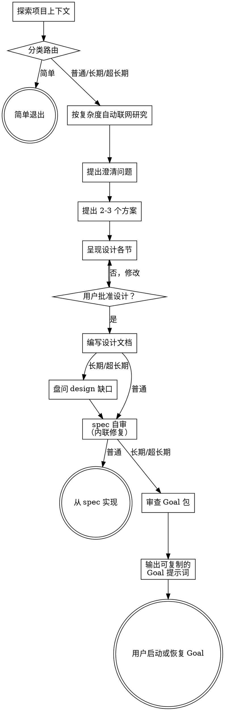

# 将想法头脑风暴为设计

通过自然的协作对话，帮助把想法转化为完整的设计和 spec。

从理解当前项目上下文开始，然后逐个提问以精炼想法。一旦你理解了要构建的东西，呈现设计并获得用户批准。按任务缩放工作流并按可观察范围路由；对于长期或超长期工作，用 Goal 扩展代替独立计划。

<HARD-GATE>
在你呈现设计并获得用户批准之前，不要调用任何实现 skill、编写任何代码、搭建任何项目或采取任何实现动作。这适用于每个项目，无论看起来多简单。长期/超长期批准仅允许包和审查工作；随后交付 `/goal`。实现需要显式启动/恢复该未更改的 Goal。
</HARD-GATE>

## 何时使用本技能

对简单且需求明确的请求（如一行修复、错别字、配置值修改、无设计选择的单工具函数），不要主动调用本技能——直接进入实现与验证。仅当存在未解决的范围、行为、架构、UX 或有意义的设计权衡，或用户显式调用时才使用本技能。

但小 diff 不自动等于简单：公共 API、安全、模式/数据迁移、兼容性、不可逆操作和不明确的 bug 修复决策仍是设计或诊断工作，按下方流程路由。

## 按可观察范围路由

在最小有用的只读检查后分类。持续时间是信号，不是唯一标准。

| 路由 | 可观察条件 | 必需输出 |
|---|---|---|
| **简单退出** | 结果明确；局部、低风险的机械变更；无实质性设计选择或缺失信息 | 离开此 skill 并使用正常的实现/验证工作流 |
| **普通设计** | 一个连贯的行为或组件；有意义的设计选择；通常约两小时内可执行 | 一个可执行 spec |
| **长期目标** | 预期工作超过两小时，跨越需求边界，需要中断安全的延续，或受益于多个有界 agent | 阶段规格、design spec、精简 Goal 包 |
| **超长期目标** | 多日/多周工作、昂贵基线、长生命周期进程、大型完整性清单、重复的工具辅助比较或持久证据 | 长期目标输出加上更强的阶段证据和审查治理 |

### 简单退出

当每个简单条件都成立时，立即停止此 skill。不要提出设计问题、提出方法、编写 spec 或请求批准。如果后续检查暴露出有意义的选择，返回此处并在编辑前选择适当的设计路由。

### 超长期附加控制

超长期目标在长期目标之上增加控制——此处摘要、详见 `references/ultra-long-goal-workflow.md`：维护完整工作项清单（每项有稳定 ID、范围、依赖、实现目标、验证、证据、风险、终止状态）；依赖性工作前探测每个必需工具和证据路径；对昂贵证据使用确定性比较；以有界等待、健康检查和清理监控长生命周期进程（绝不盲目等待）；通过 `progress.md` 保证中断安全；design 风险需要时在每个阶段退出运行独立第二遍检查。

## 清单

分类后仅为每个适用步骤创建任务；不要为跳过的路由创建占位任务。

1. **探索项目上下文** — 检查文件、文档、近期提交。
2. **分类路由** — 在最小只读检查后将工作分类为简单退出、普通设计、长期目标或超长期目标。
3. **按复杂度自动联网研究** — 分类后、在提澄清问题、冻结架构、阶段规格或 design spec 前自动执行。模型按复杂度自行决定研究深度（不询问用户）：探索性/小众/新兴/不确定或中大型工作检索当前网络/GitHub 证据并回写 spec；简单稳定的本地工作记录 `research_not_required` 后继续。触发条件与须留存的证据记录见「外部研究与复用」节。
4. **提出澄清问题** —— 逐个提出，理解目的/约束/成功标准。
5. **提出 2-3 个方案** —— 附权衡和你的推荐。
6. **呈现设计** —— 按复杂度分节，每节后获得用户批准。
7. **编写设计文档** —— 普通：把一份可执行 spec 保存到 `docs/superpowers/specs/YYYY-MM-DD-<topic>-design.md` 并提交。长期/超长期：编写阶段规格和 design spec，然后运行 design 缺口访谈（见长期/超长期 Goal 扩展）并把每个答案回写进 spec；缺口访谈完成后才进入自审和 Goal 生成。任何路由都不得创建独立实现计划文件。
8. **spec 自审** —— 快速内联检查占位符、矛盾、歧义、范围；长期/超长期还需验证每个阶段有稳定 ID、精确的双向路径/版本，以及 design 中的需求到阶段可追溯性。
9. **交付与过渡到实现** —— 普通：在所需授权后直接从可执行 spec 实现；不要调用 writing-plans。长期/超长期：自审通过后，按 `references/goal-prompt-template.md` 作为契约（其保真门禁、模板覆盖图和审查规则，而非泛泛参考）生成 Goal 提示词包，以用户输入语言编写 `goal.md`（中文提问→简体中文；否则英文），审查至 `approved`，然后输出恰好一条 `/goal "<resolved goal.md>"` 命令并停止；用户运行该命令启动/恢复 Goal，实现仅从该未更改 Goal 的显式启动/恢复开始。

## 流程图



**终止状态是直接从 spec 实现（普通）或 `/goal` 交付（长期/超长期）；简单退出更早离开本技能进入正常实现/验证工作流。** 不要从头脑风暴调用 writing-plans、frontend-design、mcp-builder 或任何其他实现 skill。长期/超长期的交付物就是这段可复制的 Goal 提示词本身（`goal.md`）：审查并 `approved` 后，输出恰好一条 `/goal "<absolute-path-to-goal.md>"` 命令并停止；用户运行该命令启动/恢复 Goal，实现仅从该未更改 Goal 的显式启动/恢复开始。

## 流程

**理解想法：**

- 首先查看当前项目状态（文件、文档、近期提交）。
- 在提出详细问题前，评估范围：如果请求描述了多个独立子系统（例如"构建一个含聊天、文件存储、计费和分析的平台"），立即指出。不要把问题花在细化一个需要先分解的项目的细节上。
- 如果项目对单个 spec 来说过大，帮助用户分解为子项目：独立的部分有哪些、它们如何关联、应按什么顺序构建？然后通过正常设计流程头脑风暴第一个子项目。每个子项目有自己的 spec → 实现周期（普通），或 spec → Goal 包周期（长期/超长期）。
- 对范围合适的项目，逐个提问以精炼想法。
- 尽可能优先使用多选题，但开放题也可以。
- 每条消息只问一个问题——如果某个主题需要更多探索，拆成多个问题。
- 聚焦于理解：目的、约束、成功标准。

**探索方案：**

- 提出 2-3 个不同方案，附权衡。
- 以对话方式呈现选项，附你的推荐和理由。
- 以你推荐的选项开头并说明原因。当只有一种方法满足约束时，不要制造替代方案。

**呈现设计：**

- 一旦你认为自己理解了要构建的东西，呈现设计。
- 按复杂度调整每节规模：简单的用几句话，细致的多达 200-300 字。
- 每节后询问目前是否看起来正确。
- 涵盖：架构、组件、数据流、错误处理、测试。
- 准备好在某些地方说不通时回去澄清。

**为隔离和清晰而设计：**

- 把系统拆成更小的单元，每个单元有单一明确的目的，通过定义良好的接口通信，且能被独立理解和测试。
- 对每个单元，你应能回答：它做什么、你如何使用它、它依赖什么？
- 别人不读内部实现能否理解一个单元做什么？你能否在不破坏调用方的情况下修改内部？如果不能，边界需要调整。
- 更小、边界良好的单元也更容易让你处理——你能更好地推理可一次性放入上下文的代码，当文件聚焦时你的编辑也更可靠。当一个文件变大时，这通常是它在做太多事的信号。

**在现有代码库中工作：**

- 在提出变更前探索当前结构。遵循现有模式。
- 当现有代码存在影响工作的问题（例如过大的文件、不清晰的边界、纠缠的职责）时，把针对性改进作为设计的一部分——就像好开发者改进他们正在工作的代码那样。
- 不要提出无关的重构。保持聚焦于服务当前目标。

## 外部研究与复用

在最小只读检查和路由分类后、在最终确定问题、架构、阶段规格或 design spec 前运行研究门：

- **探索性/开放研究：** 当问题属于小众、新兴、时间敏感、不确定或明确要求外部参考时，在头脑风暴开始时启动网络研究。使用当前权威文档和带日期的来源将未知转化为设计决策。
- **GitHub 框架/仓库研究：** 对于中/大路由，在架构或 design spec 冻结前搜索 GitHub，寻找可维护、兼容的框架、库、工具、测试 harness 和参考仓库以降低风险或成本。在选择构建或复用前比较替代方案。
- **简单稳定的本地路由：** 不要仅为仪式浏览；记录 `research_not_required` 并继续。

对每次搜索记录外部证据记录：问题、源 URL/仓库、版本/提交、日期、声明、置信度/限制、许可证/安全/维护/版本适配、决策、验证和失效条件。将其输入适用的 spec 和可追溯性；在批准前审查变更决策。将模型知识视为假设；绝不声称检查或合并模型权重。

生成的 Goal 消费这些已审查产物。除非已批准的 spec 明确定义运行时研究动作，否则它不启动新的研究阶段。

## 设计之后

**文档：**

- 普通：把一份可执行 spec 写入 `docs/superpowers/specs/YYYY-MM-DD-<topic>-design.md`，除非仓库或用户规则选择其他位置，并提交。它包含：目标、范围、非目标、治理约束、已批准决策；架构、单元、接口、数据/状态流、错误、兼容性、权限边界；带目标文件或发现规则的有序实现步骤；适用的 TDD 或替代验证方法、命令、预期结果、验收证据；回滚/阻塞条件和完成标准。
- 长期/超长期：按长期任务产物布局编写阶段规格和 design spec，然后准备 Goal 包（见长期/超长期 Goal 扩展）。任何路由都不要创建独立实现计划文件。
- 如可用，使用 elements-of-style:writing-clearly-and-concisely skill。
- 把设计文档提交到 git。

**spec 自审：**
写完 spec 文档（或长期/超长期在 grill 把答案回写后的 design 草案）后，以全新眼光审视它：

1. **占位符扫描：** 有任何 "TBD"、"TODO"、不完整的章节或模糊的需求吗？修复它们。
2. **内部一致性：** 有章节互相矛盾吗？架构与功能描述匹配吗？对于长期/超长期，每个阶段文件是否有稳定 ID、精确的双向路径/版本、依赖与进入/退出门，以及 design 中的需求到证据可追溯性？
3. **范围检查：** 它是否聚焦到适合单个实现，还是需要分解？
4. **歧义检查：** 任何需求可能有两种解读吗？如果是，选定一种并明确。

内联修复所有问题。无需重新审查——修复后继续即可。

**用户审阅门禁：**
不要请用户审阅已写的 spec 或 Goal 包。没有用户审阅环节，也不要插入该环节。

**实现：**

- 普通：在所需授权后直接从可执行 spec 实现。不要调用 writing-plans 或任何独立计划 skill。仅调用所需的实现/诊断 skill，然后从 spec 实现。
- 长期/超长期：Goal 包审查并 `approved` 后，交付恰好一条可复制的 `/goal "<absolute-path-to-goal.md>"` 命令并结束。不要从头脑风暴调用 writing-plans 或任何实现 skill。实现仅从该未更改 Goal 的显式启动/恢复开始。
- 交付前的"continue"指完成/审查包，不是源编辑。

## 长期/超长期 Goal 扩展

长期和超长期路由用下方的 Goal 核心流程代替单份 spec。不要为简单退出或普通设计加载这些。

### 长期任务产物布局

使用一个规范的、人类可读的 `task_key`：`YYYY-MM-DD-<topic>`。创建日期保持稳定。如果该 key 已用于另一个任务，追加人类可读的范围限定符或简单序号如 `-02`。绝不将 CRC、内容哈希、UUID 或随机令牌放入文件或目录名。

```text
docs/superpowers/specs/
└── YYYY-MM-DD-<topic>/
    ├── design.md
    ├── goal.md
    ├── phases/
    └── progress.md (optional runtime record)
```

design 文档是 Long/Ultra 任务的规范根，位于任务目录内 `goal.md` 旁。`goal.md` 是生成的可复制提示词，不是第二个 design 文档。`phases/` 下的阶段规格是必需的执行分解。`goal.md` 旁的 `progress.md` 是唯一运行时记录，当中断状态必须持久化时使用。

### design-阶段契约门禁

对每个长期/超长期 Goal，design 文档是规范根，必须在批准/生成前纳入阶段文档；文件名列表不足。它必须包含：每个阶段的稳定阶段 ID；精确的阶段文档路径、task key、design 版本和互惠身份链接；阶段依赖和有序进入门；阶段输入、输出、允许/仅测试/只读目标和退出门；需求到阶段的可追溯性，将每个实质性需求映射到实现目标、验证/证据、审查门和终止状态；以及暂存读取顺序，包括推进 `active_phase` 前所需的前置证据。将每个阶段与此注册表比较。孤立项、缺失互惠链接、版本不匹配、缺失可追溯性或缺失退出门为 `inconsistent` 并阻塞生成。

### Design 缺口访谈

阶段规格和 design 草案写好后（仅长期/超长期），在自审和 Goal 生成前运行有界缺口访谈。这不是普通 brainstorming 前置步骤，也不是请用户通读文档。

- **输入**：读阶段规格和 design 草案；建缺口表 `gap_id | category | evidence | question | answer_needed_to_change | owner | status`，只查相关类别（结果/范围、角色与权限、数据/状态、不变量、接口、兼容、失败/恢复、性能/资源、安全、运维、迁移、验收证据、非目标）。
- **提问规则**：每条消息一个针对性问题；仅当答案会改变行为、范围、权限、不可逆决策、依赖、验收标准或 blocker 时才问；按承重 blocker、不可逆/权限决策、验收歧义、跨阶段集成、其次低风险默认值排序；优先具体选项附简短后果说明；不重复已答问题、不重开已定决策（除非新证据矛盾）；绝不偷偷补默认值——未答的承重缺口保持 `blocked` 并附 owner 和解除条件。
- **每个答案后**：更新受影响的 design 章节、关联阶段规格/决策记录/可追溯性；标记缺口已解决/收窄/仍阻塞并附答案和时间戳；只重算假设已变的下游缺口；问下一个实质问题或停止。
- **预算**：每个 design 草案最多 12 个 grill 问题，除非用户明确要求更大访谈；达上限则停并记录剩余缺口，不问填充问题。无实质缺口→零问题（零问题路径）。
- **停止**：无未解决的承重缺口改变范围/行为/权限/依赖/验收；剩余假设显式、可逆、记录了 owner/默认/影响；design 文档和受影响阶段规格反映每个答案；矛盾有裁定或显式 blocker；预算未超。
- **记录**：`grill-completed`、问/答历史、已改章节、剩余假设、阻塞、下一 spec 审查动作——记入同级 `progress.md`（存在时），否则记入 Goal 或 design 审查章节。

### 暂存 Goal 文档加载

对于长期/超长期，除非请求完整启动，否则不要预加载未来阶段。包生成/审查可读取所有阶段。启动/恢复读取规则、design 文档、可选 `progress.md` 和活动阶段；在进入门读取未来阶段。在阶段写入前，当 `progress.md` 存在时更新它；当中断状态必须持久化时在第一次阶段写入前创建它，否则在 Goal 或活动阶段记录中记录 `staged_read_set`。完整读取目标并记录 `staged_read_set`（阶段/路径/版本/结果）。绝不声称从文件名、摘要或记忆读取。

显式完整读取指令（如 `启动前完整读取`）覆盖延迟：保留其列表，读取每个项，记录 `startup_read_set=full`，并仍在 `staged_read_set` 中记录活动阶段；否则延迟未来阶段。

在每个阶段退出，在下一阶段前创建 `phases/phase-<number>-<name>-completion.md`。记录任务/证据、审查裁定、决策、下一阶段相关性、风险/阻塞、变更目标、清理、终止状态和确切下一步动作。缺失完成记录阻塞阶段转换。

最终交付：已批准 `goal.md` -> 精确输出一个可复制命令 `/goal "<absolute-path-to-goal.md>"`。无阶段参数、正文、实现摘要、测试/构建叙述或第二条命令。对于 `issues_found`/`blocked`、缺失产物或缺失审查证据，报告阻塞和确切解除阻塞条件。

### 完整 Goal 提示词门禁

`goal.md` 是完整的可复制执行提示词，不是索引。批准前，验证可执行：

1. 身份、目标、范围/非目标、权威和禁止操作；
2. 带暂存加载的启动/恢复来源；
3. 匹配注册表的阶段，包含读取、前置条件、动作、目标、证据、门禁、回滚和阻塞状态；
4. 第一次证据动作和每次转换后的下一动作规则；
5. 验证/验收、审查、清理、交付/版本、进度、恢复和终止报告规则。

它可以链接权威 design/阶段，但必须总结可执行的操作流程。占位符、模糊动词或不可执行阶段列表无法通过门；保持状态 `issues_found`/`blocked` 且不实现。

### Goal 语言契约

用用户的任务语言编写 `goal.md`：中文请求生成简体中文；英文请求生成英文。design 文档、阶段、进度和审查摘要使用相同语言，除非源产物明确要求其他语言。精确保留命令、路径、标识符、代码和字面 UI 字符串。对于真正混合或模糊的用户语言，在起草前提一个语言问题并在 Goal 元数据中记录 `document_language`。

包含模板中每个适用的运行时控制条款，不仅是链接或"读取原始 skill"。

`goal-prompt-template.md` 的每个适用节必须映射到 `goal.md` 中的具体节和证据；使用 `template_coverage_map`，仅将真正无关的节标记为 `not_applicable` 并附理由，将遗漏标记为 `issues_found`。

将 design/Goal 审查状态声明为 `approved`、`issues_found` 或 `blocked`，并链接已保存的审查输出。绝不声称无证据的验证/审查；未解决的 design/阶段身份不匹配阻塞实现。

### 子 Agent 模型路由

按任务形状路由：简单探索/搜索/问题 → `luna_worker`（gpt-5.6-luna，max）；中等实现/测试/分析 → `terra_worker`（gpt-5.6-terra，high）；高难度实现/跨模块变更 → `sol_worker`（gpt-5.6-sol，max，workspace-write）；简单节点轻量首审（常识bug、边界、静态/泄漏、重复接口、测试正确性、过大单元、性能/UI/UX、整理）→ `luna_reviewer`（gpt-5.6-luna，max，read-only）；复杂架构/安全/兼容审查与高影响决策 → `sol_advisor`（gpt-5.6-sol，high，read-only）。`luna_reviewer` 是首道筛选，深层发现升级 `sol_advisor`。按 agent 名派遣；括号内模型仅供路由判断。仅分派独立、依赖就绪的任务包。

每个派遣包必须包含：目标、上下文、范围内/范围外文件、写入边界、验收标准、精确验证、预期返回和升级条件。仅当任务包写入不相交时并行；每个可写文件一个 owner。

`luna_worker`、`terra_worker` 和 `sol_worker` 遇以下情况必须停止并返回证据：需求模糊、接口/依赖意外变更、安全或数据完整性影响、验证不可用、范围实质性扩大、或两次失败尝试。`luna_reviewer` 和 `sol_advisor` 只读，返回发现/建议和证据，绝不声称实现。`luna_reviewer` 遇需深层判断的发现升级 `sol_advisor`。

主上下文拥有集成和最终验收——检查实际 diff 和验证结果，不接受仅凭摘要。不可用模型/通道 → 记录 `agent_unavailable`，回退或主上下文；绝不伪造结果。

### 长期和超长期路由参考

分类后，仅加载所选路由所需的参考：

- **长期目标：** 完整读取 `references/long-goal-workflow.md`。
- **超长期目标：** 先读取 `references/long-goal-workflow.md`，然后完整读取 `references/ultra-long-goal-workflow.md`。
- 在阶段规格和 design 草稿存在后，运行 design 缺口访谈（见长期/超长期 Goal 扩展的 Design 缺口访谈节）并把每个答案回写进 spec。
- 生成 Goal 提示词时，读取 `references/goal-prompt-template.md` 并遵循其生成/审查契约。
- 对于长期/超长期 Goal，解析此 skill 根，然后读取 `references/caveman/SKILL.md` 和 `references/pua/SKILL.md`。Caveman 默认启用；`normal mode`/`stop caveman` 禁用它。PUA 自身触发按其技能的场景条件（失败 2+ 次、反复微调、准备放弃等）；本技能另加周期聚焦校准——每隔 20 分钟检查一次，仅在安全命令/工具边界执行，活动命令/测试/审查期间暂停，恢复后补检一次。不维护派生 profile、绝对路径、版本或 SHA-256 字段。这些参考不能覆盖用户/仓库规则、spec 要求、授权、证据、重试上限、阻塞或终止状态。

不要为简单退出或普通设计加载长期路由参考。此渐进式披露是强制性的。

### 最终交付

当 Goal 审查为 `approved` 时，输出恰好一条可复制的 `/goal "<absolute-path-to-goal.md>"` 命令。在报告前解析并验证绝对路径。无阶段参数、正文、实现摘要、测试/构建叙述或第二条命令。对于 `issues_found`/`blocked`、缺失产物或缺失审查证据，报告阻塞和确切解除阻塞条件。当 Goal 缺失、未解决、`issues_found` 或 `blocked` 时不输出 `/goal`。

## 来源优先级

对每个路由：用户指令和仓库规则治理权威和安全；已批准的 spec 治理规范性要求；现有同级 `progress.md` 报告运行时状态。详细的长期路由优先级和变更控制位于 `references/long-goal-workflow.md`。较低层级绝不静默更改较高层级。

## 关键原则

- **一次一个问题** - 不要用多个问题让人难以招架。
- **优先多选题** - 可能时比开放题更易回答。
- **严格 YAGNI** - 从所有设计中移除不必要的功能。
- **探索替代方案** - 在确定前总是提出 2-3 个方案。
- **增量验证** - 呈现设计，在继续前获得批准。
- **保持灵活** - 当某些地方说不通时回去澄清。
- **按风险缩放** - 整体批准紧凑设计；仅当独立的高风险决策需要单独确认时才拆分为各节。
- **按可观察范围路由** - 不要对普通工作施加持久 Goal 治理；不要把单份 spec 强加于多日工作。
